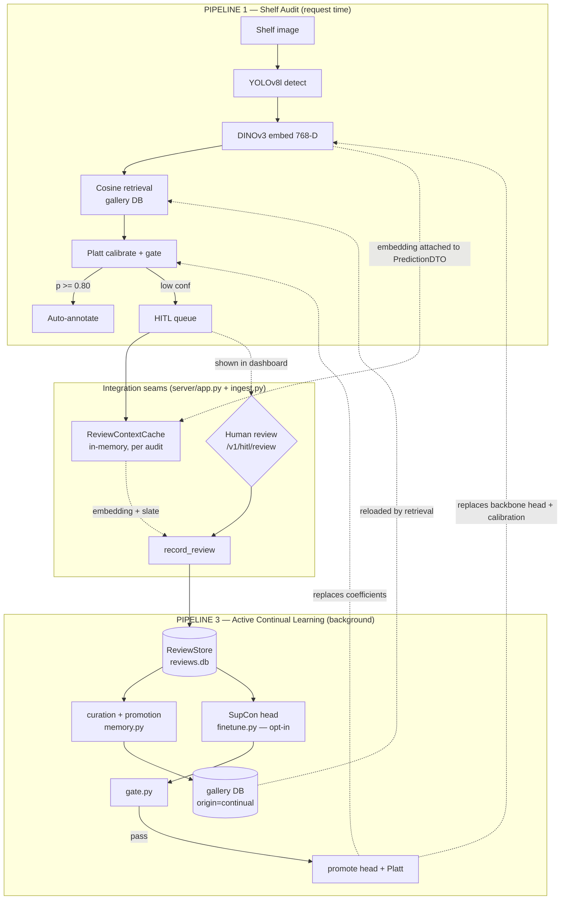

# Integrating Pipeline 3 (Active Continual Learning) with Pipeline 1 (Shelf Audit)

How the continual-learning loop plugs into the existing audit pipeline, which
files change, and how data crosses the boundary between them.

---

## 1. The two pipelines

**Pipeline 1 — Shelf Audit (already existed).** A request-time pipeline:

```
image -> YOLOv8l detect -> DINOv3 embed -> cosine retrieval -> Platt calibrate + gate
                                                                    |         |
                                                              auto-annotate  HITL queue
```

Orchestrated by `ml/orchestrator.py`, served by `server/app.py`.

**Pipeline 3 — Active Continual Learning (added).** A background loop that
consumes the HITL output of Pipeline 1, improves the gallery and (optionally)
the embedding, and writes the improvements back into Pipeline 1.

The two meet at **three shared artifacts**:

| Shared artifact | Written by | Read by |
| :--- | :--- | :--- |
| Gallery DB `retail_sku_registry_dinov3.db` | Pipeline 3 `memory.py` | Pipeline 1 retrieval |
| Query embedding (768-D) | Pipeline 1 embed stage | Pipeline 3 review store |
| Platt coefficients + projection head | Pipeline 3 `gate.py` (on promotion) | Pipeline 1 embed + calibrate |

---

## 2. Integration points (the actual code touched)

Only **four** integration seams were added to Pipeline 1. Everything else lives
inside `ml/active_learning/`.

### Seam 1 — carry the embedding out of the audit
`ml/base.py` — `PredictionDTO` gained an `embedding` field (internal, never
serialized to the API response).
`ml/orchestrator.py` — `process_shelf` sets `embedding=embedding_dto.vector` on
every prediction (both HITL and auto paths). The vector is already computed for
retrieval, so this is free — no second backbone pass.

### Seam 2 — cache audit context server-side
`server/app.py` — `_format_audit_response` calls
`review_context_cache.put_predictions(...)` for the HITL queue and the
annotations. The `ReviewContextCache` (`ml/active_learning/ingest.py`) is a
bounded LRU holding each crop's embedding + candidate slate between the audit
response and the eventual human verdict.

### Seam 3 — wire the review endpoint to the store
`server/app.py` — `POST /v1/hitl/review` now calls
`record_review(...)` (`ingest.py`), which looks up the cached context and writes
a row to `ReviewStore` (`store.py`). Startup initializes `review_store_plugin`;
shutdown flushes it and clears the cache.

### Seam 4 — write improvements back
`ml/active_learning/memory.py` — `GalleryMemoryUpdater` writes promoted review
crops into the **same** gallery DB Pipeline 1 reads, tagged
`origin="continual"`. `gate.py`, on promotion, emits a recalibrated Platt fit
and a projection head for Pipeline 1's embed/calibrate stages.

> **Design guarantee:** Pipeline 1 is never mutated silently. The gallery only
> changes through `memory.py` (versioned, reversible); the serving embedding
> only changes through `gate.py` (which refits calibration and re-measures
> automation rate first). Training a head changes neither on its own.

---

## 3. End-to-end data flow



The two dashed arrows back into P1 (`GDB -> RET`, `PROMO -> EMB/CAL`) are what
make the system *continual* rather than a one-shot audit.

---

## 4. Request lifecycle (a single crop's journey)

1. **Audit.** `POST /v1/audit/shelf` runs Pipeline 1. A crop scores 0.78 →
   routed to the HITL queue. Its 768-D embedding rides along on the
   `PredictionDTO` and is cached server-side keyed by `(image, crop_id)`.
2. **Display.** The dashboard renders the HITL row with a SKU dropdown.
3. **Review.** A merchandiser picks the correct SKU and clicks Save →
   `POST /v1/hitl/review`.
4. **Store.** `record_review` pulls the cached embedding and writes one
   `reviews` row + its `review_candidates` slate. Response confirms
   `embedding_captured: true`.
5. **Later — fast loop.** An operator runs
   `loop.py session --apply`: promote reviewed crops into the gallery, re-curate,
   mark the batch consumed. Pipeline 1's next retrieval load sees the new
   vectors.
6. **Later — slow loop (optional).** After ~500 reviews,
   `loop.py finetune` trains a challenger head; `gate.py` decides whether it
   replaces Pipeline 1's serving embedding.

Steps 1-4 happen inside Pipeline 1's request cycle. Steps 5-6 are operator-run
and offline.

---

## 5. What Pipeline 1 owns vs. what Pipeline 3 owns

| Concern | Owner |
| :--- | :--- |
| Detection, embedding, retrieval, gating at request time | Pipeline 1 |
| Attaching the embedding to predictions | Pipeline 1 (`orchestrator.py`) |
| Caching context, storing reviews | Pipeline 3 (`ingest.py`, `store.py`) |
| Curation, promotion, gallery writeback | Pipeline 3 (`curation.py`, `memory.py`) |
| Confusion mining, SupCon head, promotion gate | Pipeline 3 (`hard_negatives.py`, `finetune.py`, `gate.py`) |
| Deciding *when* to run the loops | Operator (`loop.py` CLI) |

Pipeline 1 has **no dependency** on Pipeline 3 — remove `ml/active_learning/`
and the audit still runs. The coupling is one-way: Pipeline 3 reads Pipeline 1's
output and writes Pipeline 1's inputs, through the four seams above.

---

## 6. Running the integrated system

```bash
# 1. Start the server — Pipeline 1 live, Pipeline 3 store initialized
python -m uvicorn server.app:app --host 127.0.0.1 --port 8000

# 2. Audit a shelf (browser at http://127.0.0.1:8000, or:)
curl -m 550 http://127.0.0.1:8000/v1/audit/sample -o audit_out.json

# 3. Review HITL crops in the dashboard -> writes to reviews.db

# 4. Fast loop: fold reviews into the gallery Pipeline 1 reads
python -m ml.active_learning.loop \
    --review-db data/processed/active_learning/reviews.db \
    --gallery-db data/processed/crops/gt_clean/retail_sku_registry_dinov3.db \
    session --cap 500 --apply

# 5. Slow loop (after ~500 reviews): train + gate a challenger head
python -m ml.active_learning.loop --review-db <path> finetune --force
```

See `HOW_TO_RUN_PIPELINE3.txt` for the full runbook and measured results.
```
