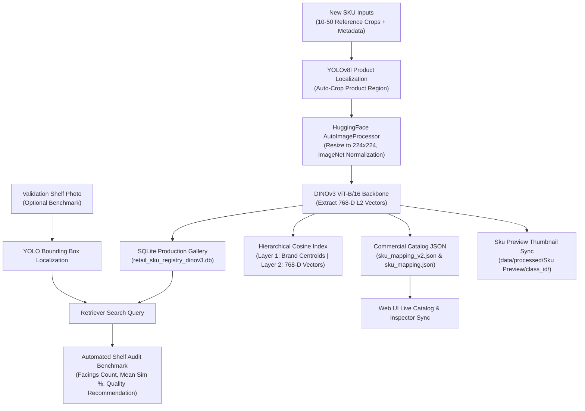

# Pipeline 2: Few-Shot New SKU Onboarding Engine — Complete Technical Documentation

## Executive Summary

**Pipeline 2** is the **Few-Shot New SKU Onboarding Engine** of the Enterprise Retail AI Platform. It enables the system to onboard novel or previously un-trained commercial product SKUs into the retrieval database **in seconds without retraining deep learning models** (such as YOLO or DINO).

By uploading **10 to 50 reference product crop images** of a new SKU, Pipeline 2 extracts normalized 768-D visual feature embeddings via **DINOv3**, registers the vectors directly into the production database (`data/processed/crops/gt_clean/retail_sku_registry_dinov3.db`), updates the active 2-layer hierarchical cosine search index in memory, populates commercial catalog metadata in `sku_mapping_v2.json`, syncs catalog thumbnails to `data/processed/Sku Preview/class_{class_id}/`, and runs an automated **Validation Shelf Recognition Audit** to benchmark detection accuracy before production deployment.

---

## 1. System Architecture & Workflow



---

## 2. Step-by-Step Pipeline Engine Details

### Step 1: Input Ingestion & YOLO Product Cropping
Pipeline 2 supports two input ingestion workflows implemented in `SKUOnboarder` (`ml/onboarding/onboarder.py`):

1. **Reference Product Images Mode (`onboard_from_crops`)**:
   - Accepts 10 to 50 reference images (`.jpg`, `.png`, `.webp`) of the target product.
   - Leverages **YOLOv8l** (`yolov8l-sku110k.pt`) to detect product packaging borders automatically and crop tightly onto the product region before feature extraction.
   - Enforces count limits ($10 \le N \le 50$) to guarantee sufficient visual diversity.

2. **Raw Shelf Image Mode (`onboard_from_shelf_images`)**:
   - Ingests full shelf photos and uses YOLO auto-detection or matching `.txt` annotation files (`YOLOLabelBoxProvider`) to extract product crops.

---

### Step 2: Reference Crop Quality Gate Bypass
- **Bypass Rule**: Strict `BboxQualityGate` rejection (blur / aspect ratio) is bypassed for user-uploaded onboarding reference crops.
- **Rationale**: Reference photos uploaded by merchandisers may have slight shadows or angles; accepting all 10–50 crops maximizes few-shot visual diversity.

---

### Step 3: DINOv3 768-D Feature Embedding Extraction
Crops are processed by `DINOv3Extractor` (`ml/embeddings/dinov3.py`):
1. **Resizing & Padding**: Resized to **$224 \times 224$ pixels** via `AutoImageProcessor`.
2. **Transformer Forward Pass**: Computes 768-dimensional CLS token feature representations matching the production gallery.
3. **$L_2$-Vector Normalization**:
   $$\mathbf{v}_{\text{norm}} = \frac{\mathbf{v}}{\|\mathbf{v}\|_2}$$
   Ensures cosine dot-product similarity search is invariant to lighting variations.

---

### Step 4: Production Database Persistence & Index Sync
- **SQLite Production Gallery Store (`retail_sku_registry_dinov3.db`)**:
  - Writes metadata, bounding box coordinates, class ID, and 768-D float32 binary vector bytes into `retail_sku_registry_dinov3.db`.
- **In-Memory Retrieval Index (`HierarchicalCosineIndex`)**:
  - Updates **Layer 1** (Brand Centroids) and **Layer 2** (Brand Vectors) dynamically in memory for instant query matching without server restart.
- **Catalog Thumbnail Sync (`Sku Preview`)**:
  - Copies the 1st reference crop exemplar into `data/processed/Sku Preview/class_{class_id}/crop_0.jpg` to render high-resolution catalog thumbnails.

---

### Step 5: Auto-Class ID Assignment & Commercial Catalog Registration
- **Auto-Class ID Assignment**: If `class_id` is omitted or `-1`, the engine automatically computes:
  $$\text{new\_class\_id} = \max(\{ \text{class\_ids} \}) + 1$$
- **Catalog JSON Updates**: Appends the 8-attribute commercial metadata schema into `configs/sku_mapping_v2.json` and `configs/sku_mapping.json`.

---

### Step 6: Validation Shelf Recognition Audit Benchmark
- Accepts **1 full validation shelf photo**.
- Runs YOLO product localization + visual vector retrieval against newly registered SKU embeddings.
- **Metrics Calculated**:
  - `facings_detected`: Count of new SKU facings recognized on shelf.
  - `mean_similarity`: Average cosine similarity score ($S_{\text{vis}}$).
  - `pass_validation`: Boolean indicator ($\text{facings} > 0$ and $S_{\text{vis}} \ge 75\%$).
  - `recommendation`: Automated guidance guidance (e.g. *"✅ Sufficient Examples (94.1% Quality)"*).

---

## 3. Web Application UI Integration

The Web UI features a dedicated page and button for Pipeline 2:

### Navigation Bar Button
- Prominent glowing button: **`+ Add New SKU (Pipeline 2)`**.

### Onboarding Workbench Panel (`#tab-sku-onboarding`)
- **Metadata Inputs**: Form fields for commercial catalog schema with an **Auto-Incremented** New Class ID field and refresh button.
- **Reference Crops Upload Zone**:
  - Drag & Drop zone enforcing `10 to 50 reference images of the new SKU`.
  - Dynamic file counter badge (`10-50 Crops Required`).
  - Real-time thumbnail preview grid.
- **Validation Shelf Image Upload**: Single-file upload control for live shelf audit verification.
- **Action Button**: `<button id="btn-submit-onboard">` with loading spinner.
- **Diagnostic & Benchmark Card**:
  - Registered Commercial Catalog Card preview.
  - Vector Stats ($D=768$, `retail_sku_registry_dinov3.db`).
  - Validation Shelf Audit Metrics & Recommendation Badge.
  - Automatic refresh of the **Commercial Catalog** tab grid!

---

## 4. API Specification

### Endpoint: `POST /v1/onboard/sku`

#### Request Parameters (Form Data):
| Parameter | Type | Required | Description |
| :--- | :--- | :--- | :--- |
| `brand` | `str` | **Yes** | Brand family name (e.g. `"Nesquik"`). |
| `product_name` | `str` | **Yes** | Core product name (e.g. `"Chocolate Drink Mix"`). |
| `class_id` | `Optional[int]` | No | Class ID (auto-generated if omitted or `-1`). |
| `variant` | `Optional[str]` | No | Variant or flavor (e.g. `"Cocoa Powder"`). |
| `size` | `Optional[str]` | No | Package size/weight (e.g. `"400g"`). |
| `pack_type` | `Optional[str]` | No | Form factor (`"box"`, `"pouch"`, `"bottle"`, `"can"`, etc.). |
| `display_name` | `Optional[str]` | No | Commercial display title. |
| `notes` | `Optional[str]` | No | Description / notes. |
| `reference_images` | `List[UploadFile]` | **Yes** | 10 to 50 reference product crop files. |
| `validation_shelf_image` | `Optional[UploadFile]` | No | 1 full shelf photo for validation audit benchmark. |

#### JSON Response Schema:
```json
{
  "status": "success",
  "class_id": 72,
  "version": 3,
  "crops_added": 15,
  "metadata": {
    "raw_class_id": "72",
    "training_class_id": 72,
    "project_sku_id": "TM_RAW_072",
    "brand": "Nesquik",
    "product_name": "Chocolate Drink Mix",
    "variant": "Cocoa Powder",
    "size": "400g",
    "pack_count": "15 crops",
    "pack_type": "pouch",
    "display_name": "Nesquik Chocolate Drink Mix Cocoa Powder",
    "status": "verified",
    "identity_confidence": "A",
    "instance_count": 15,
    "source_image_count": 15,
    "evidence": "Onboarded via Web UI (Pipeline 2)",
    "notes": "Rich chocolate flavoured milk powder"
  },
  "validation_audit": {
    "facings_detected": 3,
    "mean_similarity": 0.914,
    "pass_validation": true,
    "recommendation": "Sufficient Examples — High Recognition Quality (3 facings recognized with 91.4% similarity)"
  }
}
```

---

## 5. How to Run & Deploy

### Command Line Execution:
```bash
python scripts/onboard_new_sku.py --mode crops --data-dir "data/Nesquik" --family-id "Nesquik"
```

### Web Server Execution:
```bash
python -m uvicorn server.app:app --host 127.0.0.1 --port 5000 --reload
```

### Automated Unit Test Suite:
```bash
python -m unittest tests/test_pipeline2_onboarding.py tests/test_api_audit_e2e.py
```
*Output*: `Ran 6 tests in 21.498s -> OK`

