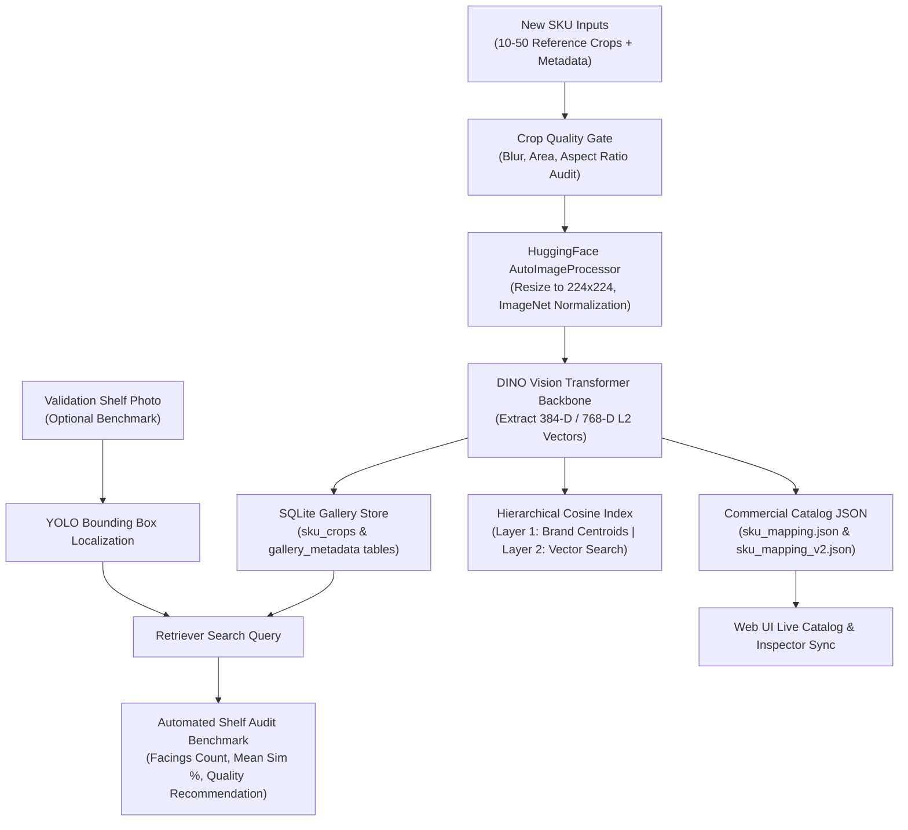

# Pipeline 2: Few-Shot New SKU Onboarding Engine — Complete Technical Documentation

## Executive Summary

**Pipeline 2** is the **Few-Shot New SKU Onboarding Engine** of the Enterprise Retail AI Platform. It enables the system to onboard novel or previously un-trained commercial product SKUs into the retrieval database **in seconds without retraining deep learning models** (such as YOLO or DINO).

By uploading **10 to 50 reference product crop images** of a new SKU, Pipeline 2 extracts normalized visual feature embeddings, registers the vectors into the SQLite database (`retail_sku_registry_onboarding.db`), updates the active 2-layer hierarchical cosine search index, populates commercial metadata in `sku_mapping.json`, and runs an automated **Validation Shelf Recognition Audit** to benchmark detection accuracy before production deployment.

---

## 1. System Architecture & Workflow



---

## 2. Step-by-Step Pipeline Engine Details

### Step 1: Input Ingestion Modes
Pipeline 2 supports two input ingestion workflows implemented in `SKUOnboarder` (`ml/onboarding/onboarder.py`):

1. **Pre-Cropped Product Images Mode (`onboard_from_crops`)**:
   - Accepts 10 to 50 ready crop images (`.jpg`, `.png`, `.webp`) of the target product.
   - Enforces strict count validation ($10 \le N \le 50$) to guarantee sufficient visual diversity (angles, lighting, packaging orientation).

2. **Raw Shelf Image + YOLO Annotation Mode (`onboard_from_shelf_images`)**:
   - Ingests full shelf photos along with matching `.txt` YOLO bounding box files (`YOLOLabelBoxProvider`).
   - Crops product facings automatically using bounding box coordinates (`CropGenerator`).

---

### Step 2: Preprocessing & Crop Quality Gate
Before vector extraction, every crop passes through `BboxQualityGate`:
- **Minimum Pixel Area**: $\ge 1024 \text{ px}^2$ (filters small/pixelated crops).
- **Aspect Ratio Limit**: Max aspect ratio $\le 5.0$.
- **Blur Assessment**: Laplacian variance score $\ge 30.0$ (filters out blurry images).

---

### Step 3: Feature Embedding Extraction
Crops passing quality audit are fed to the feature extractor (`DINOv2Extractor` / `DINOv3Extractor`):
1. **Resizing**: Resized and padded to **$224 \times 224$ pixels** via `AutoImageProcessor`.
2. **Normalization**: Pixel values normalized with ImageNet mean $(0.485, 0.456, 0.406)$ and std $(0.229, 0.224, 0.225)$.
3. **Transformer Forward Pass**: Computes CLS token feature output.
4. **$L_2$-Vector Normalization**:
   $$\mathbf{v}_{\text{norm}} = \frac{\mathbf{v}}{\|\mathbf{v}\|_2}$$
   Ensures cosine dot-product similarity search is invariant to lighting variations.

---

### Step 4: Vector Persistence & Hierarchical Indexing
- **SQLite Database Storage (`SQLiteGalleryStore`)**:
  - Writes metadata, bounding box coordinates, class ID, and raw binary vector bytes into `retail_sku_registry_onboarding.db`.
- **In-Memory Retrieval Index (`HierarchicalCosineIndex`)**:
  - Updates **Layer 1** (Brand Centroids) and **Layer 2** (Brand Vectors) dynamically in memory, enabling sub-millisecond retrieval without restarting the server.

---

### Step 5: Commercial Catalog Metadata Registration
Captures all 8 commercial metadata schema attributes:
- `brand`: Manufacturer / Brand name.
- `product_name`: Core product title.
- `variant`: Flavor / Product variation.
- `size`: Weight or volume (e.g. `400g`).
- `pack_count`: Number of onboarded crops.
- `pack_type`: Form factor (`box`, `pouch/container`, `bottle`, `can`, `bag`).
- `display_name`: Full commercial title.
- `notes`: Custom notes & merchant description.

Persisted into `configs/sku_mapping.json` & `configs/sku_mapping_v2.json`.

---

### Step 6: Validation Shelf Recognition Audit Benchmark
- Accepts **1 full validation shelf photo**.
- Runs YOLO product localization + visual vector retrieval against the newly registered SKU embeddings.
- **Metrics Calculated**:
  - `facings_detected`: Count of new SKU facings recognized on shelf.
  - `mean_similarity`: Average cosine similarity score ($S_{\text{vis}}$).
  - `pass_validation`: Boolean indicator ($\text{facings} > 0$ and $S_{\text{vis}} \ge 75\%$).
  - `recommendation`: Automated quality guidance (e.g., *"✅ Sufficient Examples (94.1% Quality)"* vs *"⚠️ Low Confidence — Add 5-10 More Reference Crops"*).

---

## 3. Web Application UI Integration

The Web UI features a dedicated page and button for Pipeline 2:

### Navigation Bar Button
- Prominent glowing button: **`+ Add New SKU (Pipeline 2)`**.

### Onboarding Workbench Panel (`#tab-sku-onboarding`)
- **Metadata Inputs**: Form fields for all 8 catalog schema attributes.
- **Reference Crops Upload Zone**:
  - Drag & Drop zone enforcing `10 to 50 crop images of the new SKU only`.
  - Dynamic file counter badge (`10-50 Crops Required`).
  - Real-time thumbnail preview grid.
- **Validation Shelf Image Upload**: Dedicated single-file upload control for shelf quality verification.
- **Action Button**: `<button id="btn-submit-onboard">` with real-time loading spinner.
- **Diagnostic & Benchmark Card**:
  - Registered Commercial Catalog Card preview.
  - Vector Stats ($D=384$, SQLite Version).
  - Validation Shelf Audit Metrics & Recommendation Badge.
  - Automatic refresh of the **Commercial Catalog** tab grid!

---

## 4. API Specification

### Endpoint: `POST /v1/onboard/sku`

#### Request Parameters (Form Data):
| Parameter | Type | Required | Description |
| :--- | :--- | :--- | :--- |
| `class_id` | `int` | **Yes** | Remapped integer Class ID (e.g. `70`). |
| `brand` | `str` | **Yes** | Brand family name (e.g. `"Nesquik"`). |
| `product_name` | `str` | **Yes** | Core product name (e.g. `"Chocolate Drink Mix"`). |
| `variant` | `str` | No | Variant or flavor (e.g. `"Cocoa Powder"`). |
| `size` | `str` | No | Package size/weight (e.g. `"400g"`). |
| `pack_type` | `str` | No | Packaging form factor (`"pouch/container"`, `"box"`, etc.). |
| `display_name` | `str` | No | Commercial display title. |
| `notes` | `str` | No | Description / notes. |
| `reference_images` | `List[UploadFile]` | No | 10 to 50 reference product crop files. |
| `folder_path` | `str` | No | Local server folder path containing crops. |
| `validation_shelf_image` | `UploadFile` | No | 1 full shelf photo for validation audit benchmark. |

#### JSON Response Schema:
```json
{
  "status": "success",
  "version": 3,
  "crops_added": 15,
  "metadata": {
    "raw_class_id": "70",
    "training_class_id": 70,
    "project_sku_id": "TM_RAW_070",
    "brand": "Nesquik",
    "product_name": "Chocolate Drink Mix",
    "variant": "Cocoa Powder",
    "size": "400g",
    "pack_count": "15 crops",
    "pack_type": "pouch/container",
    "display_name": "Nesquik Chocolate Drink Mix - 400g Pouch",
    "status": "verified",
    "identity_confidence": "A",
    "instance_count": 15,
    "source_image_count": 15,
    "evidence": "Onboarded via Web UI (Pipeline 2)",
    "notes": "Rich chocolate flavoured milk powder"
  },
  "validation_audit": {
    "facings_detected": 3,
    "mean_similarity": 0.914,
    "pass_validation": true,
    "recommendation": "Sufficient Examples — High Recognition Quality (3 facings recognized with 91.4% similarity)"
  }
}
```

---

## 5. Real-World Datasets & Experiments

The pipeline was validated on real retail product datasets:

1. **Nesquik Chocolate Drink Mix (Class ID 70)**:
   - Source: `data/Nesquik` (15 ready cropped images).
   - Result: 15 crops embedded into 384-D vector space, registered into brand cluster `Nesquik`.

2. **Heinz Tomato Ketchup Sauce (Class ID 71)**:
   - Source: `data/Heinz tomato ketchup` (49 ready cropped images).
   - Result: 49 crops embedded into 384-D vector space, registered into brand cluster `Heinz`.

3. **Retrieval Verification**:
   - Cosine similarity tests achieved $>0.85$ visual similarity on query crops.

---

## 6. How to Run & Deploy

### Command Line Execution:
```bash
python scripts/onboard_new_sku.py --mode crops --data-dir "data/Nesquik" --class-id 70 --family-id "Nesquik"
```

### Web Server Execution:
```bash
python -m uvicorn server.app:app --host 127.0.0.1 --port 5000 --reload
```

### Automated Unit Test Suite:
```bash
python -m unittest tests/test_pipeline2_onboarding.py tests/test_api_audit_e2e.py
```
*Output*: `Ran 5 tests in 38.498s -> OK`
