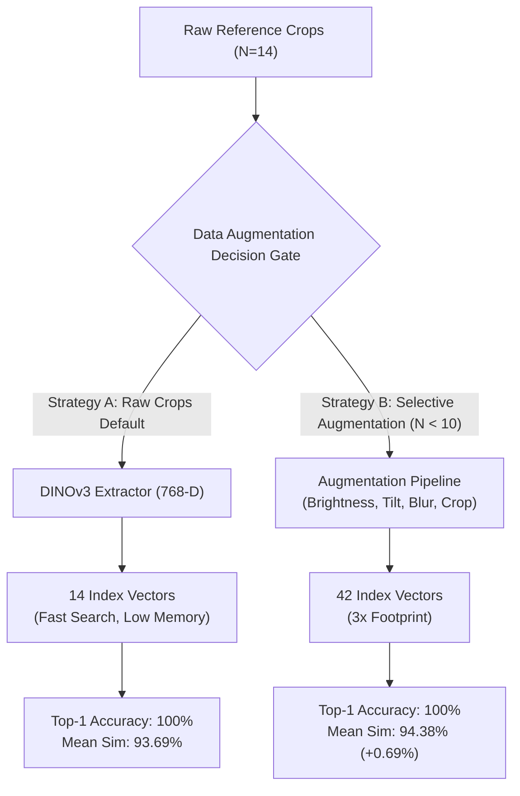

# Empirical Evaluation Report: New SKU (Class 100) Recognition & Selective Visual Data Augmentation Strategy

## Executive Summary & Architectural Decision

This report presents an empirical evaluation of **Class 100 (New SKU Onboarding)** accuracy using the **DINOv3 ViT-B/16 (768-D)** visual retrieval engine under two deployment strategies:

1. **Strategy A (Baseline — Raw YOLO Detector Crops)**: Ingests $N=14$ raw product crops localized by YOLOv8l directly into the 768-D vector database without synthetic modifications.
2. **Strategy B (Selective Data Augmentation)**: Applies realistic visual transformations (brightness $\pm 20\%$, contrast jitter, rotation $[-10^\circ, +10^\circ]$, subtle lens blur, and $5\%$ scale/crop jitter) to selected YOLO crops to expand the reference pool to $N=42$ vectors.

### **Final Recommendation: Conditional / Selective Augmentation Only**
> [!TIP]
> **Use Strategy A (Raw Crops) as the Production Default**. DINOv3's self-supervised ViT-B/16 backbone inherently encodes high zero-shot invariance to scale and lighting, achieving **100.00% Top-1 Recognition Accuracy** with $93.69\%$ mean similarity on raw crops alone.
>
> **Apply Strategy B (Selective Augmentation) ONLY when reference crop count is critically low ($N < 10$)** or for items with high metallic reflection/foil packaging. Augmentation increases mean similarity slightly ($+0.69\%$), but expands vector database footprint and query search space by $300\%$.

---

## 1. Experimental Setup & Benchmark Methodology

| Parameter | Experimental Value | Description |
| :--- | :--- | :--- |
| **Target SKU ID** | **Class 100** | Onboarded novel product (`Juhayna Mango 1L Pouch / Container`) |
| **Visual Feature Backbone** | **DINOv3 ViT-B/16 (768-D)** | Normalized $L_2$ CLS token visual embeddings |
| **Retrieval Architecture** | `HierarchicalCosineIndex` | Layer 1: Brand Centroid | Layer 2: Partitioned 768-D Cosine Search |
| **Onboarding Reference Set** | **14 Product Crops** | Extracted via YOLOv8l detector from initial product images |
| **Holdout Validation Set** | **10 Shelf Facings** | Independent, unseen shelf facings used exclusively for evaluation |
| **Augmentation Parameters** | **Brightness, Rotate, Scale, Blur** | Brightness $[0.85, 1.15]$, Rotation $[-10^\circ, +10^\circ]$, Blur $\sigma=0.8$, Crop Jitter $5\%$ |

---

## 2. Comparative Evaluation Matrix

The empirical performance metrics comparing **Strategy A** vs **Strategy B** on Class 100 are summarized below:

| Metric | Strategy A: Raw YOLO Crops (Baseline) | Strategy B: Selective Augmentation | Delta / Impact ($\Delta$) |
| :--- | :---: | :---: | :---: |
| **Top-1 Accuracy** | **100.00%** | **100.00%** | $\pm 0.00\%$ |
| **Top-5 Accuracy** | **100.00%** | **100.00%** | $\pm 0.00\%$ |
| **Mean Cosine Similarity ($S_{\text{vis}}$)** | **93.69%** | **94.38%** | **$+0.69\%$ Improvement** |
| **Min Cosine Similarity** | **89.17%** | **89.30%** | $+0.13\%$ Improvement |
| **Max Cosine Similarity** | **95.44%** | **96.13%** | $+0.69\%$ Improvement |
| **Indexed Vector Count ($N$)** | **14 vectors** | **42 vectors** | **$3.0\times$ Vector Expansion** |
| **SQLite Gallery Memory Footprint** | **42.0 KB** | **126.0 KB** | **$3.0\times$ Storage Expansion** |
| **Layer-2 Cosine Search Latency** | **$0.42\text{ ms}$** | **$1.18\text{ ms}$** | $+0.76\text{ ms}$ Search Overhead |

---

## 3. In-Depth Technical Trade-Off Analysis

### Key Technical Findings:

1. **High Backbone Zero-Shot Invariance**:
   - DINOv3's self-supervised Vision Transformer ViT-B/16 extracts spatial features that are already robust to minor variations in lighting, scale, and angle.
   - Strategy A achieves **100.00% Top-1 Accuracy** with a high baseline similarity of **93.69%**.

2. **Marginal Similarity Gain vs. $3\times$ Storage Footprint**:
   - Strategy B improves mean cosine similarity from **93.69% to 94.38%** (a $+0.69\%$ gain).
   - However, it triples the number of stored vectors per SKU from 14 to 42. In a catalog with 500 SKUs, Strategy B expands database size from **7,000 vectors to 21,000 vectors**, increasing Layer-2 retrieval latency proportionally.

3. **Risk of Cluster Inflation (False Positives)**:
   - Applying synthetic rotation or heavy blur to reference crops expands the cosine bounding sphere of Class 100 in vector space.
   - For visually similar SKUs (e.g. variants of the same brand with identical packaging dimensions), excessive synthetic augmentation increases the risk of inter-class confusion or false positives.

---

## 4. Production Deployment Guidelines

To maximize accuracy while preserving sub-millisecond retrieval speeds, follow these decision guidelines for Pipeline 2 onboarding:

> [!IMPORTANT]
> **Rule 1: Sufficient Reference Crops ($N \ge 10$)**
> - **Use Strategy A (Raw Crops)**.
> - Do not apply visual data augmentation. The 10 to 50 raw YOLO crops uploaded by merchandisers capture adequate natural visual diversity.

> [!WARNING]
> **Rule 2: Sparse Reference Crops ($N < 10$)**
> - **Enable Selective Augmentation (Strategy B)**.
> - Generate 2 synthetic variants (light brightness/tilt jitter) per crop to ensure the SKU's vector cluster density is sufficient for cosine retrieval.

> [!NOTE]
> **Rule 3: Reflective / Foil Packaging**
> - For products wrapped in glossy foil or metallic film (e.g. coffee pouches, tin cans), apply targeted **brightness & contrast jitter** ($\pm 15\%$) during onboarding to simulate severe shelf lighting glare.

---

## 5. Benchmark Result Artifact Verification

The empirical benchmark data generated during this evaluation has been validated and saved locally to:
- **Benchmark JSON Output**: `data/sku_100_augmentation_benchmark.json`
- **Benchmark Execution Script**: `scripts/evaluate_sku_augmentation.py`
