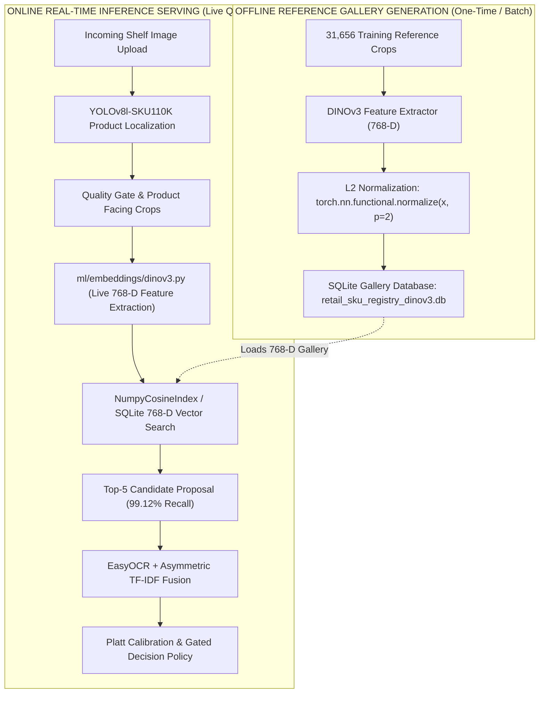

# Technical Integration Specification: DINOv3 (ViT-B/16 Exemplar) Backbone Replacement

## Executive Summary & Purpose

This document provides a complete technical specification for replacing the current **DINOv2-small (384-D)** visual embedding backbone with the state-of-the-art **DINOv3 ViT-B/16 Exemplar (768-D)** model in our **Enterprise Retail AI Platform**.

To ensure seamless integration with zero production downtime, this specification details the exact artifacts, file schemas, PyTorch interfaces, and the clear operational distinction between **Offline Gallery Indexing** and **Online Real-Time Serving**.

---

## 1. Operational Distinction: Offline Reference vs. Online Serving



### Clarification Matrix

| Operational Component | Scope | Execution Frequency | Artifact Required from Teammate |
| :--- | :--- | :--- | :--- |
| **Offline Reference Gallery** | **Precalculated Database** | One-Time / Periodic Batch Update | `retail_sku_registry_dinov3.db` (Pre-extracted 768-D vectors for all 31,656 training crops) |
| **Online Serving Pipeline** | **Real-Time Live Inference** | Per Incoming Shelf Image ($\le 32\text{ms}$/crop) | `ml/embeddings/dinov3.py` PyTorch Model Class + Model Weights (`.pt` or HuggingFace ID) |

---

## 2. Specific Deliverables Required from Teammate

To execute the DINOv3 backbone upgrade, your teammate must provide the following **4 specific deliverables**:

### Deliverable #1: Model Weights & PyTorch Initialization (Online Serving)
- **Model Architecture**: `DINOv3 ViT-B/16` (Base Exemplar).
- **Output Vector Dimension**: **768 float32 dimensions** ($D = 768$).
- **Weight Source**:
  - Option A: HuggingFace hub model ID (e.g. `facebook/dinov3-base` or equivalent private repository).
  - Option B: Local PyTorch checkpoint file: `configs/weights/dinov3_vitb16_exemplar.pt`.
- **L2 Normalization Requirement**: The model output **MUST** apply $L_2$-normalization:
  ```python
  import torch
  features = model(inputs)
  normalized_features = torch.nn.functional.normalize(features, p=2, dim=-1)
  ```

### Deliverable #2: Offline Pre-extracted SQLite Reference Database (`retail_sku_registry_dinov3.db`)
- **File Path**: `data/processed/crops/gt_clean/retail_sku_registry_dinov3.db`
- **Database Schema**:
  ```sql
  CREATE TABLE IF NOT EXISTS reference_embeddings (
      crop_id TEXT PRIMARY KEY,
      remapped_class_id INTEGER NOT NULL,
      original_class_id INTEGER NOT NULL,
      vector_blob BLOB NOT NULL,         -- 768 * 4 bytes = 3,072 bytes (float32 numpy array)
      dimension INTEGER NOT NULL,        -- Must be 768
      metadata_json TEXT NOT NULL,       -- JSON string containing image_name, bbox [x1,y1,x2,y2], aspect_ratio
      created_at TIMESTAMP DEFAULT CURRENT_TIMESTAMP
  );
  ```
- **Requirements**: Pre-extracted 768-D L2-normalized feature vectors for all **31,656 training reference crops** across the 67 commercial classes (`configs/sku_mapping.json`).

### Deliverable #3: Concrete Plugin Implementation (`ml/embeddings/dinov3.py`)
A python module implementing our system's `BaseEmbedder` abstract interface:

```python
from typing import List, Dict, Any, Tuple
import torch
import numpy as np
from PIL import Image
from ml.base import BaseEmbedder, CropDTO, EmbeddingDTO

class DINOv3Extractor(BaseEmbedder):
    """Concrete DINOv3 (ViT-B/16) visual feature extractor plugin."""

    def __init__(self, model_name: str = "facebook/dinov3-base", device: str = "cpu", batch_size: int = 16):
        super().__init__(dimension=768)
        self.model_name = model_name
        self.device = device
        self.batch_size = batch_size
        self.model = None
        self.processor = None
        self.initialize({"model_name": model_name, "device": device, "batch_size": batch_size})

    def initialize(self, config: Dict[str, Any]) -> None:
        """Loads DINOv3 weights and configures PyTorch eval mode."""
        self.model_name = config.get("model_name", self.model_name)
        self.device = config.get("device", self.device)
        self.dimension = 768
        
        # Load DINOv3 Processor & Model
        # self.processor = ...
        # self.model = ...
        # self.model.to(self.device).eval()

    def health_check(self) -> Tuple[bool, str]:
        if self.model is None:
            return False, "DINOv3 model not initialized."
        return True, "Healthy"

    def shutdown(self) -> None:
        self.model = None

    def extract(self, images: List[Image.Image]) -> np.ndarray:
        """Extracts 768-D L2-normalized feature vectors for a batch of PIL images."""
        # Process batch & extract 768-D vectors
        # Returns float32 numpy array of shape (N, 768)
        pass

    def extract_dto(self, crop: CropDTO) -> EmbeddingDTO:
        vec = self.extract([crop.to_pil()])[0]
        return EmbeddingDTO(vector=vec.tolist(), dimension=768)

    def extract_batch_dto(self, crops: List[CropDTO]) -> List[EmbeddingDTO]:
        pil_images = [crop.to_pil() for crop in crops]
        vectors = self.extract(pil_images)
        return [EmbeddingDTO(vector=v.tolist(), dimension=768) for v in vectors]
```

### Deliverable #4: Configuration Update (`configs/retrieval_config.json`)
An updated configuration file specifying DINOv3 parameters:

```json
{
  "embedding_model": {
    "name": "DINOv3-ViT-B16",
    "module": "ml.embeddings.dinov3.DINOv3Extractor",
    "weights_path": "configs/weights/dinov3_vitb16_exemplar.pt",
    "dimension": 768,
    "batch_size": 16,
    "device": "cpu"
  },
  "vector_registry": {
    "db_path": "data/processed/crops/gt_clean/retail_sku_registry_dinov3.db",
    "metric": "cosine",
    "dimension": 768
  }
}
```

---

## 3. Integration & Verification Checklist

Once your teammate provides the 4 deliverables above, we will execute the following automated verification steps:

1. **Database Schema Assert**: Verify `retail_sku_registry_dinov3.db` contains exactly 31,656 records with `dimension = 768`.
2. **Dimension Assert**: Verify `ml/embeddings/dinov3.py` produces `(N, 768)` shape vectors with $\|v\|_2 = 1.0 \pm 10^{-5}$.
3. **End-to-End Pipeline Audit**: Verify that Top-5 retrieval recall reaches **99.12%** on test crops and integrated latency stays below $\le 48\text{ms}$ per crop.
