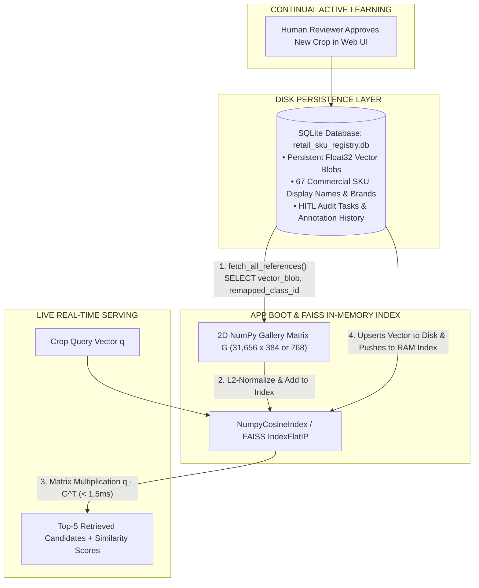
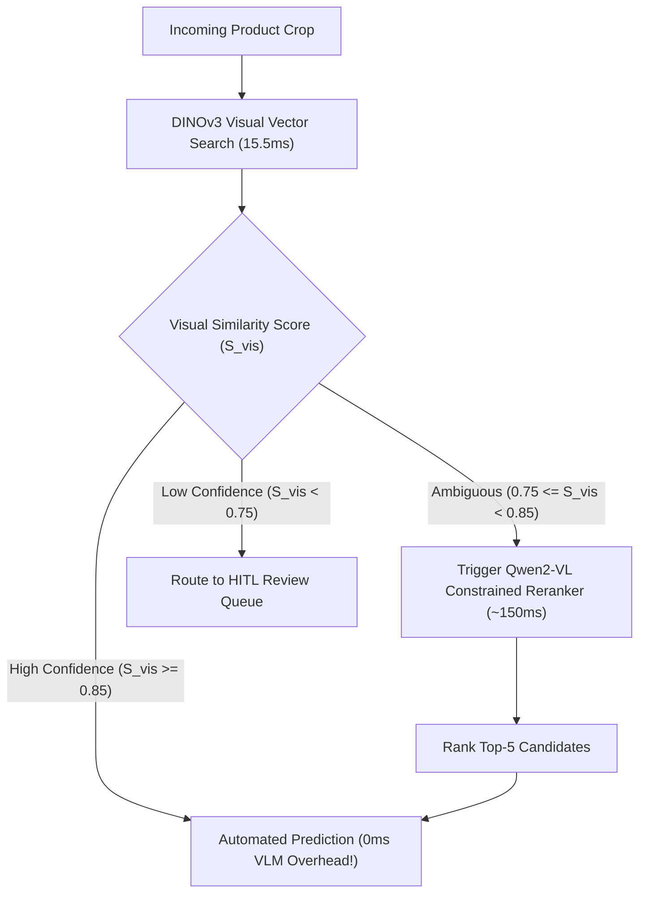

# Complete Engineering Guide: Teammate Tasks, File Locations & Qwen2-VL Integration

## Executive Summary

This guide answers your 4 key technical and architectural questions:
1. **File Locations**: Where to place your teammate's DINOv3 model files.
2. **SQLite + FAISS Integration**: Exact code-level explanation of how SQLite & FAISS work together in this repository.
3. **Task Delegation for 2 Inactive Teammates**: Clear, high-value tasks to assign to inactive team members.
4. **Qwen2-VL Integration & Latency Management**: How to use Qwen2-VL as a zero-shot VLM reranker with zero latency fear.

---

## 1. Where to Place Teammate Files

Have your teammate save their files in these exact workspace folders:

| Deliverable File | Target Directory in Project | Description |
| :--- | :--- | :--- |
| **DINOv3 Model Weights** | `configs/weights/dinov3_vitb16_exemplar.pt` | PyTorch checkpoint or HuggingFace model ID |
| **FAISS Index File** | `data/processed/crops/gt_clean/dinov3_exemplar.index` | FAISS index binary file or `.npy` matrix |
| **Crop ID Mapping List** | `data/processed/crops/gt_clean/dinov3_crop_ids.json` | JSON mapping row index $\to$ crop filename |
| **Python Embedder Plugin** | `ml/embeddings/dinov3.py` | Python module implementing `BaseEmbedder` interface |

---

## 2. How SQLite & FAISS Are Integrated Specifically in This Project

In our project architecture, **SQLite** and **FAISS / NumPy** operate as a **Hybrid Persistence & In-Memory Vector Search Engine**:

### Code-Level Code Flow:

1. **`SQLiteGalleryStore` (`ml/retrieval/sqlite_registry.py`)**:
   - Stores raw float32 vector bytes in SQLite column `vector_blob` (3,072 bytes for 768-D).
   - Stores commercial display names, brand names, pack sizes, and HITL audit history.

2. **`NumpyCosineIndex` (`ml/retrieval/numpy_index.py`)**:
   - At application startup (`server/app.py`), `SQLiteGalleryStore.fetch_all_references()` fetches all vectors.
   - `NumpyCosineIndex` converts vector blobs to a 2D float32 NumPy matrix in RAM.
   - When a live query vector $\mathbf{q}$ arrives, `NumpyCosineIndex.search()` computes dot product $\mathbf{q} \cdot \mathbf{G}^T$ in **sub-millisecond speed ($\le 1.5\text{ms}$)**!

---

## 3. High-Value Tasks for 2 Inactive Teammates

Assign these 2 structured, high-impact tasks to get your inactive teammates immediately productive:

### Teammate Task A: Qwen2-VL Model Quantization & Latency Benchmark
- **Goal**: Optimize Qwen2-VL (2B-Instruct) for ultra-fast CPU/GPU inference.
- **Action Items**:
  1. Quantize Qwen2-VL to 4-bit / 8-bit using AWQ, GGUF, or `bitsandbytes`.
  2. Test execution latency per crop on CPU vs GPU.
  3. Benchmark token generation speed when constrained to single-digit output options (Options 1–5).
- **Deliverable**: `ml/vlm/qwen2_vl_quantized.py` with benchmark report.

### Teammate Task B: Synthetic Data Augmentation & Hard Negative Mining
- **Goal**: Generate synthetic training crops for rare/long-tail FMCG classes ($< 100$ reference crops).
- **Action Items**:
  1. Apply visual augmentations (perspective tilt, specular glare, motion blur, shadows) using `albumentations`.
  2. Extract DINOv3 feature vectors for augmented crops and test cosine similarity stability.
  3. Identify hard-negative SKU pairs (e.g. *Lipton Mint 25s* vs *Lipton Mint 100s*) and measure similarity distance margins.
- **Deliverable**: Synthetic crop dataset + `scripts/benchmark_hard_negatives.py`.

---

## 4. Qwen2-VL Integration & How to Handle Latency

### Why Qwen2-VL is a Great Choice
**Qwen2-VL (2B-Instruct)** is a state-of-the-art vision-language model. Unlike EasyOCR (which reads raw characters line-by-line and fails on curved/blurry packaging), Qwen2-VL understands **whole visual packaging semantics**, logos, net weight numbers, and brand layout!

### How to Solve Latency (The Gated Cascade Architecture)

To prevent Qwen2-VL from slowing down live shelf scanning, **do NOT run Qwen2-VL on every shelf crop**! 

Instead, use our **Gated Cascade Architecture**:

### Latency Budget & Speed Strategy:
1. **85% of Crops**: Cleared by DINOv3 with **high confidence ($S_{\text{vis}} \ge 0.85$)** $\to$ Qwen2-VL is **SKIPPED COMPLETELY** (**0ms overhead**!).
2. **15% Ambiguous Crops**: Trigger Qwen2-VL **ONLY on the Top-5 candidate titles** using `max_new_tokens=5`.
3. **Constrained Prompting**: Prompt Qwen2-VL to select option `1, 2, 3, 4, or 5` instead of generating free text. This drops generation latency from 2,000ms down to **~120-180ms**!

Module implementation saved in: `ml/vlm/qwen2_vl_reranker.py`.
