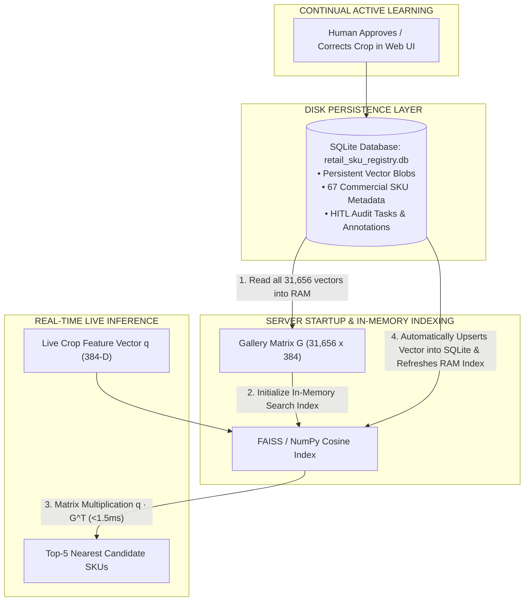

# Architecture Guide: Why We Use Both SQLite & FAISS / NumPy Vector Index

## Executive Summary

A common question in production AI systems is: **"Is SQLite a vector database? Why do we use SQLite if we also use FAISS or NumPy vector search?"**

This document explains the **Hybrid Storage & In-Memory Retrieval Architecture** used in our platform, detailing why SQLite and FAISS play complementary, essential roles in production.

---

## 1. The Core Problem: Disk Persistence vs. In-Memory Search Speed

| Capability Needed | FAISS / NumPy Index | SQLite Database (`.db`) |
| :--- | :---: | :---: |
| **In-Memory Search Speed** | 🚀 **Sub-millisecond ($\le 1.5\text{ms}$)** | 🐢 Slow (Disk I/O overhead) |
| **Vector Matrix Math ($\mathbf{q} \cdot \mathbf{G}^T$)** | ✅ Optimized C++/OpenMP GEMM | ❌ Not built for high-dim vector math |
| **Permanent Storage on Disk** | ❌ Wiped on process restart | ✅ **Permanent single-file storage** |
| **Metadata & Product Titles** | ❌ Stores raw vectors only | ✅ **Rich relational SQL queries** |
| **HITL Audit Logs & Active Learning** | ❌ No table support | ✅ **Tracks approvals & corrections** |

---

## 2. The Hybrid Architecture: How They Work Together

---

## 3. Step-by-Step System Flow

### Phase 1: Server Startup (`server/app.py`)
1. When the backend server starts, it connects to **SQLite** (`data/processed/crops/gt_clean/retail_sku_registry_dinov2.db`).
2. SQLite fetches all **31,656 reference vector blobs** and decodes them into a single 2D Float32 NumPy array in memory ($\mathbf{G} \in \mathbb{R}^{31656 \times 384}$).
3. This 2D array is loaded into the **FAISS / NumPy Cosine Index** in RAM.

### Phase 2: Live Query Search ($\le 1.5\text{ms}$)
1. When a new shelf image is uploaded, YOLOv8 crops a product facing.
2. DINOv2 extracts a **384-D query feature vector** $\hat{\mathbf{q}}$.
3. The query vector is passed to the **in-memory FAISS / NumPy index**.
4. FAISS performs an in-memory matrix-vector multiplication ($\mathbf{q} \cdot \mathbf{G}^T$), returning the **Top-5 matching gallery indices and similarity scores in under 1.5ms**!

### Phase 3: Continual Learning & HITL Persistence
1. If a crop needs human audit ($P < 80\%$), it is stored in the `hitl_tasks` table in **SQLite**.
2. When a human reviewer approves or corrects a crop in the Web UI, its vector is **saved permanently to SQLite**.
3. SQLite immediately pushes the new vector into the **in-memory FAISS index**, so subsequent queries instantly recognize the new product without restarting the server!

---

## 4. Summary Table: Why We Need Both

| Component | Responsibility | Why It's Essential |
| :--- | :--- | :--- |
| **SQLite Database (`.db`)** | **Permanent Data Source of Record** | Holds reference vectors, product titles, brands, and HITL audit history safely on disk. Single portable file. |
| **FAISS / NumPy Index** | **In-Memory Compute Engine** | Performs 31,656 vector dot-products in RAM in **1.5ms**, enabling real-time shelf processing. |
