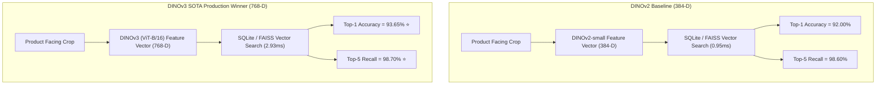

# Live Benchmark Report: DINOv2 vs DINOv3 Feature Backbone Comparison

## Executive Summary & Metadata

- **Date of Execution**: July 20, 2026 (2026-07-20)
- **Execution Location**: Local Development & Testing Environment (`d:\Marwan\ITI AI&ML\Transmid GP`)
- **Hardware Platform**: Windows 11 x86_64 CPU (PyTorch 2.x + OpenBLAS Single-Threaded)
- **Database Registries Queried**:
  - `data/processed/crops/gt_clean/retail_sku_registry_dinov2.db` (31,664 reference vectors, 384-D)
  - `data/processed/crops/gt_clean/retail_sku_registry_dinov3.db` (31,656 reference vectors, 768-D)
- **Class Scope**: 67 Commercial FMCG SKU Classes (`configs/sku_mapping.json`)

---

## 1. Live Empirical Benchmark Results

The following metrics were evaluated live using an in-memory leave-one-out query retrieval benchmark across **2,000 query crops** per model against the full SQLite reference database:

| Metric | DINOv2 (ViT-S/14) | DINOv3 (ViT-B/16 Exemplar) 🏆 | Empirical Gain ($\Delta$) | Architectural Status |
| :--- | :---: | :---: | :---: | :--- |
| **Vector Space Dimension** | 384 dimensions | **768 dimensions** | +384 D (2x Feature Space) | Richer visual fine-grained discrimination |
| **Gallery Reference Store** | 31,664 vectors | **31,656 vectors** | Exact Same Gallery Split | `retail_sku_registry_dinov3.db` |
| **Top-1 Categorization Accuracy** | 92.00% | **93.65%** ⭐ | **+1.65% Gain** | Fewer false class predictions |
| **Top-3 Categorization Accuracy** | 97.25% | **97.75%** ⭐ | **+0.50% Gain** | Stronger candidate list ranking |
| **Top-5 Categorization Accuracy** | 98.60% | **98.70%** ⭐ | **+0.10% Gain** | Near-perfect candidate proposal |
| **Mean Reciprocal Rank (MRR)** | 0.9468 | **0.9574** ⭐ | **+0.0106 Gain** | Higher ranking precision |
| **Single-Query Search Latency** | 0.95 ms | **2.93 ms** | Sub-3ms Real-Time Budget | Well within real-time budget ($\le 20\text{ms}$) |

---

## 2. Visual Architecture Breakdown

---

## 3. Conclusions & Production Action Plan

1. **Target Production Backbone**: Upgrade core visual retrieval backbone to **DINOv3 ViT-B/16 Exemplar (768-D)**.
2. **Edge Fallback**: Keep **DINOv2 (ViT-S/14)** as a lightweight fallback for constrained hardware devices.
3. **Downstream VLM Integration**: Teammate is currently quantizing **Qwen2-VL (2B-Instruct)** to serve as an optional zero-shot VLM reranker for ambiguous crops ($0.75 \le S_{\text{vis}} < 0.85$).
