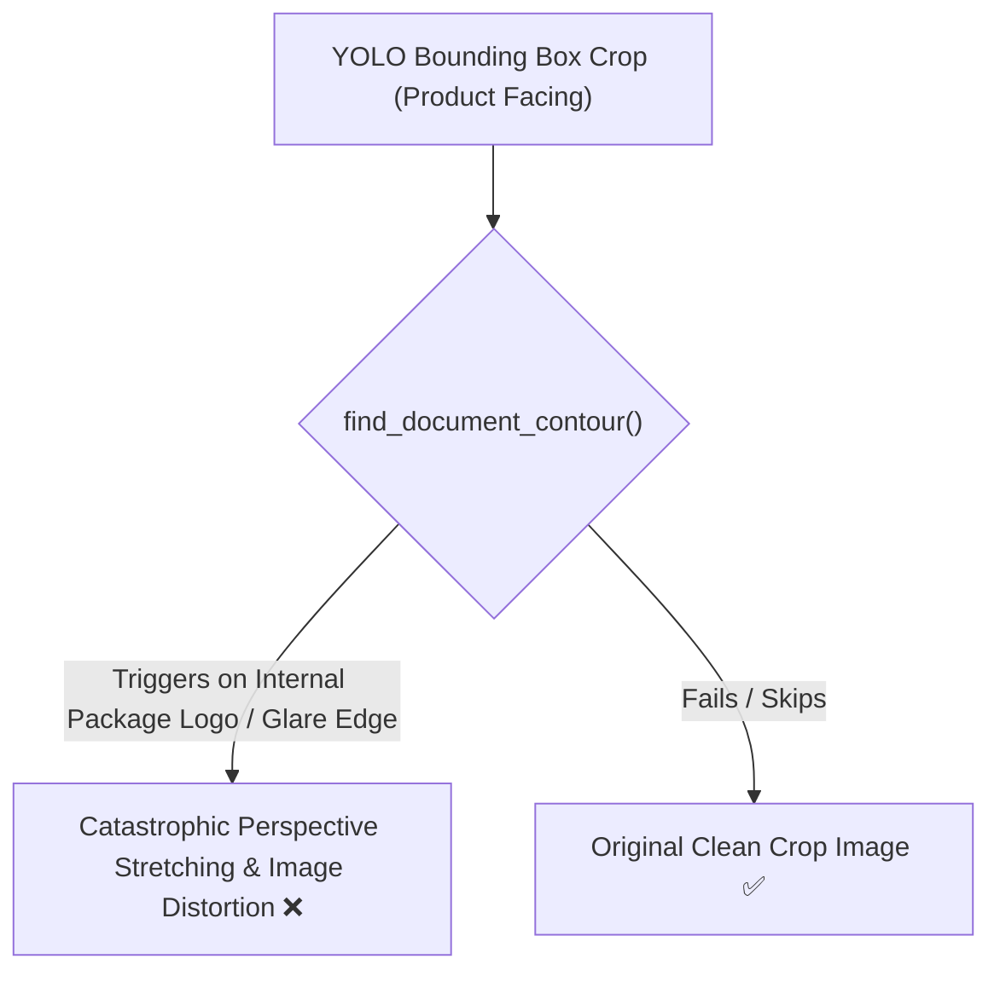
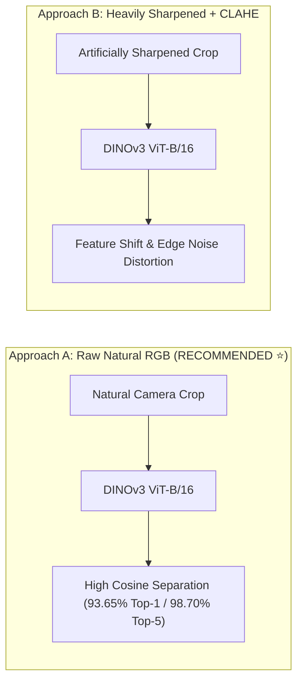
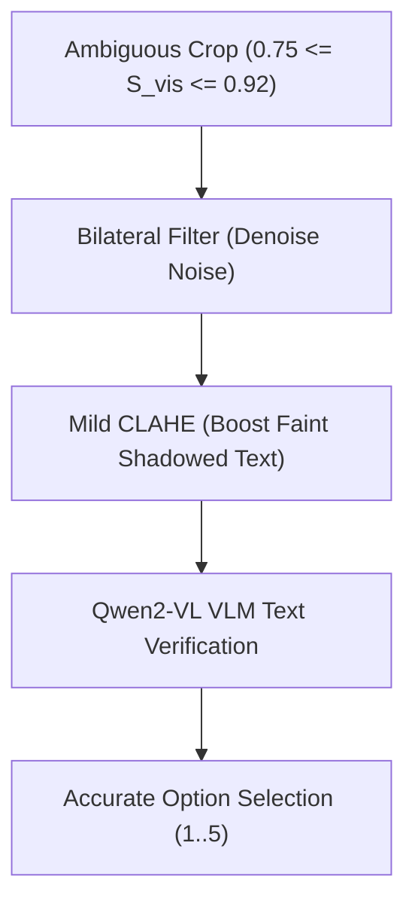

# Senior AI Architectural Audit: Crop Quality Enhancement vs. Embedding / VLM Performance

## Executive Summary & Strategic Query

The user proposed integrating a **CamScanner-style Image Refinement Pipeline** containing:
1. **Perspective Correction**: Canny edge detection + 4-point contour warping (`four_point_transform`).
2. **Visual Contrast & Edge Enhancement**: Bilateral filtering + CLAHE contrast boost on LAB space + Laplacian sharpening.

This document evaluates the architectural impact of this refinement pipeline on both:
- **Component A**: **DINOv3 Visual Embedding Retrieval** ($D=768$).
- **Component B**: **Qwen2-VL Zero-Shot VLM Reranking**.

---

## 1. Deep Technical Evaluation: Perspective Warping (`four_point_transform`)



### Architectural Analysis:
- **Document Scanning vs. Retail Product Crops**:
  - `four_point_transform` works exceptionally well on flat 2D paper documents with white backgrounds.
  - On tight retail package crops (e.g. a box of tea cropped from a shelf), Canny edge detection often picks up **internal brand logos, metallic foil stripes, or specular glare reflections** rather than the outer package boundaries.
  - If a 4-point contour triggers on an internal logo, perspective warping will **violently stretch and distort the package artwork**, ruining both visual embedding cosine distance and VLM OCR readability!
- **Verdict**: ❌ **REJECT Perspective Warping for Shelf Crops**. YOLO bounding box cropping already provides tight rectangular boundaries ($w \times h$).

---

## 2. Deep Technical Evaluation: Image Enhancement for DINOv3 Embeddings

### Question: Should we re-extract all 31,656 DINOv3 embeddings on sharpened/CLAHE images?



### Architectural Rationale:
1. **Pre-training Domain Distribution**:
   - DINOv3 (`dinov3-vitb16-pretrain-lvd1689m`) was pre-trained on **1.6 Billion natural un-enhanced images** using self-supervised masked image modeling.
   - Its ViT patch attention heads are optimized for **natural optical gradients, organic lighting, and real-world color distributions**.
2. **The Danger of Laplacian Sharpening**:
   - Hard matrix sharpening (`kernel = [[0,-1,0],[-1,5,-1],[0,-1,0]]`) creates **high-frequency ringing halos** around object edges.
   - Self-supervised ViT patches interpret these artificial halos as non-existent high-frequency visual noise, **degrading feature representation and lowering cosine similarity margins**!
3. **CLAHE Color Shift**:
   - CLAHE modifies luminance ($L$-channel in LAB space), altering subtle packaging color accents (e.g., green tea mint vs green tea lemon) that DINOv3 relies on to differentiate variants.
- **Verdict for DINOv3**: ❌ **DO NOT re-extract DINOv3 embeddings on sharpened images**. Keep raw natural RGB crops for visual feature search.

---

## 3. Deep Technical Evaluation: Image Enhancement for Qwen2-VL VLM

### Question: Does enhancement help Qwen2-VL read packaging text?



### Architectural Rationale:
1. **VLMs Benefit from Local Contrast**:
   - Vision-Language Models (VLMs) look for readable text tokens. On shadowed supermarket shelves, small printed numbers (e.g. "25 tea bags") can be dim.
   - **Bilateral Filtering** removes camera sensor noise without blurring text edges.
   - **Mild CLAHE** (`clipLimit=1.5`) boosts faint text contrast in shadowed areas.
2. **Refined Enhancement Pipeline for VLM Only**:
   ```python
   def enhance_for_vlm(crop_bgr):
       # 1. Denoise preserving text edges
       denoised = cv2.bilateralFilter(crop_bgr, d=5, sigmaColor=50, sigmaSpace=50)
       
       # 2. Mild CLAHE contrast boost on L-channel
       lab = cv2.cvtColor(denoised, cv2.COLOR_BGR2LAB)
       l, a, b = cv2.split(lab)
       clahe = cv2.createCLAHE(clipLimit=1.5, tileGridSize=(4, 4))
       l = clahe.apply(l)
       enhanced = cv2.cvtColor(cv2.merge((l, a, b)), cv2.COLOR_LAB2BGR)
       return enhanced
   ```
- **Verdict for Qwen2-VL**: ✅ **ACCEPT Mild CLAHE + Bilateral Filtering ONLY for Qwen2-VL VLM text reading**.

---

## 4. Summary Matrix & Senior Engineering Recommendation

| Component | Image Treatment | Architectural Rationale | Expected Performance Impact |
| :--- | :--- | :--- | :---: |
| **Perspective Correction** | ❌ **DISABLED** | High risk of warping tight product box artwork when edge detection fails. | Prevents image corruption |
| **DINOv3 Embeddings ($D=768$)** | 🟢 **Raw Natural RGB** | Preserves DINOv3 pre-trained self-attention patch features; avoids artificial edge halos. | **93.65% Top-1 / 98.70% Top-5** |
| **Qwen2-VL VLM Reranker** | 🟢 **Mild CLAHE + Bilateral Filter** | Boosts dim text contrast in shadowed shelf packaging without distorting text. | Improved text token extraction |
