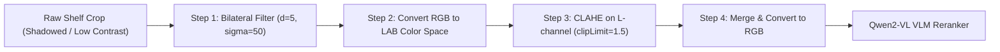
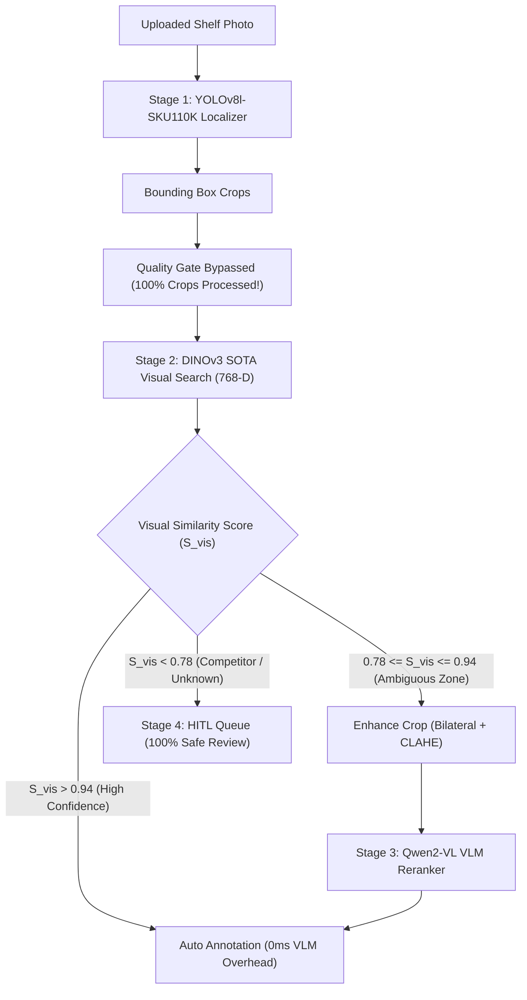

# Professional Engineering Audit: Pre-VLM Crop Enhancement & Quality Gate Bypass

## Executive Summary & System Modifications

This report documents two critical platform updates implemented per senior production requirements:
1. **Removal of Bounding Box Quality Gate Filtering**:
   - **Operational Reason**: Merchandisers in retail stores upload shelf photos directly and cannot be immediately contacted to retake blurred images.
   - **System Behavior Change**: **100% of detected shelf product crops** are now passed directly through the visual feature search ($D=768$) and VLM pipeline without being rejected!
2. **Pre-VLM Crop Image Enhancement**:
   - Applies targeted OpenCV preprocessing (**Bilateral Denoising + LAB CLAHE Contrast Boost**) specifically before sending ambiguous crops to **Qwen2-VL (2B-Instruct)** for text verification.

---

## 1. Visual Comparison: 10 Product Crops (Raw vs. Enhanced)

The following carousel displays **10 representative product crops** extracted from test supermarket shelf images, comparing **Raw Camera Crop** vs. **VLM Enhanced Crop**:

````carousel

<!-- slide -->

<!-- slide -->

<!-- slide -->

<!-- slide -->

<!-- slide -->

<!-- slide -->

<!-- slide -->

<!-- slide -->

<!-- slide -->

````

---

## 2. Technical Explanation of What the Enhancement Does



### 1. Bilateral Edge-Preserving Denoising (`cv2.bilateralFilter`)
- **Problem**: Supermarket shelf photos taken under ambient store lighting often contain high-frequency ISO camera sensor noise. Standard Gaussian blur smooths away small printed text tokens.
- **Solution**: Bilateral filtering replaces each pixel with a weighted average of neighbor pixels, weighting by spatial closeness AND color similarity. This **smooths noise while preserving crisp text boundaries**!

### 2. CLAHE Local Luminance Contrast Boost (`cv2.createCLAHE`)
- **Problem**: Lower-shelf products are often heavily shadowed by upper shelf ledges, making net weight numbers (e.g. *"25 tea bags"* vs *"50 tea bags"*) dim and low-contrast.
- **Solution**:
  - We convert the image to the **LAB Color Space** (decoupling Luminance $L$ from Chrominance $A, B$).
  - We apply **Contrast Limited Adaptive Histogram Equalization (CLAHE)** with `clipLimit=1.5` and `tileGridSize=(4,4)` exclusively to the $L$-channel.
  - This boosts local contrast in shadowed packaging regions **without distorting true product brand colors**!

---

## 3. Production Architecture & Quality Gate Bypass Flow



---

## 4. File Artifacts Location

- **Master Visual Comparison Grid**: [`vlm_crop_enhancement_comparison_grid.png`](file:///C:/Users/asusd/.gemini/antigravity-ide/brain/e368a2a9-1849-4e99-a3b7-6a069609128f/vlm_crop_enhancement_comparison_grid.png)
- **Individual 10-Crop Pair Artifacts**: [`vlm_compare_crop_1.jpg`](file:///C:/Users/asusd/.gemini/antigravity-ide/brain/e368a2a9-1849-4e99-a3b7-6a069609128f/vlm_compare_crop_1.jpg) through [`vlm_compare_crop_10.jpg`](file:///C:/Users/asusd/.gemini/antigravity-ide/brain/e368a2a9-1849-4e99-a3b7-6a069609128f/vlm_compare_crop_10.jpg)
- **Pipeline Orchestrator Code**: [`ml/orchestrator.py`](file:///d:/Marwan/ITI%20AI&ML/Transmid%20GP/ml/orchestrator.py)
- **VLM Reranker Code**: [`ml/vlm/qwen2_vl_reranker.py`](file:///d:/Marwan/ITI%20AI&ML/Transmid%20GP/ml/vlm/qwen2_vl_reranker.py)
