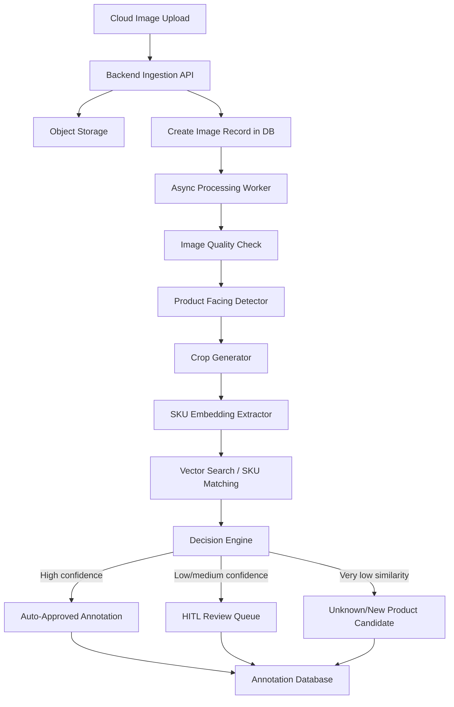
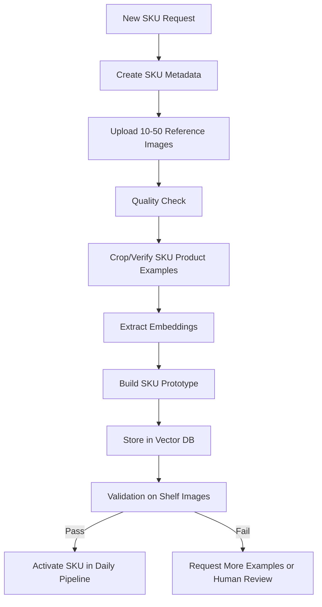
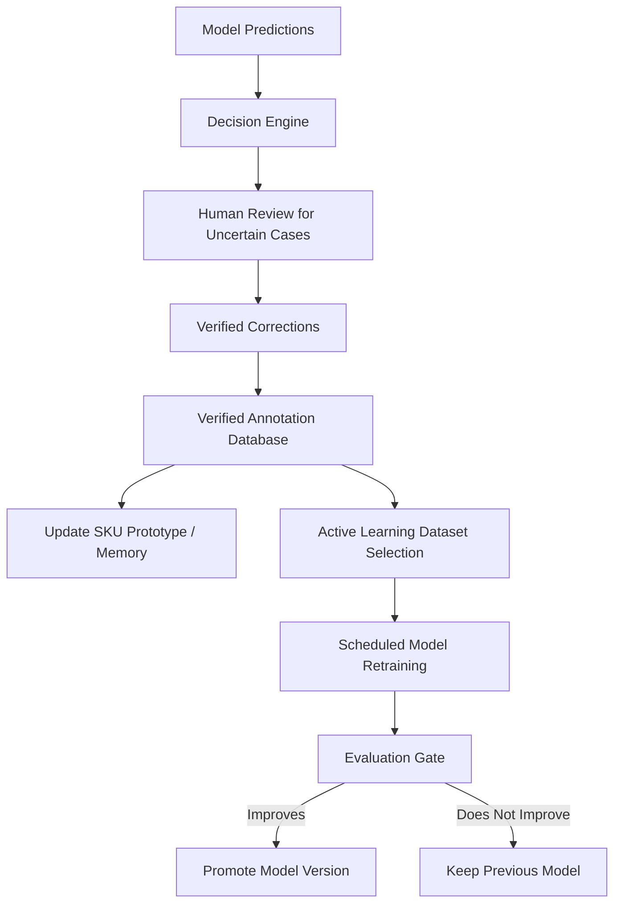
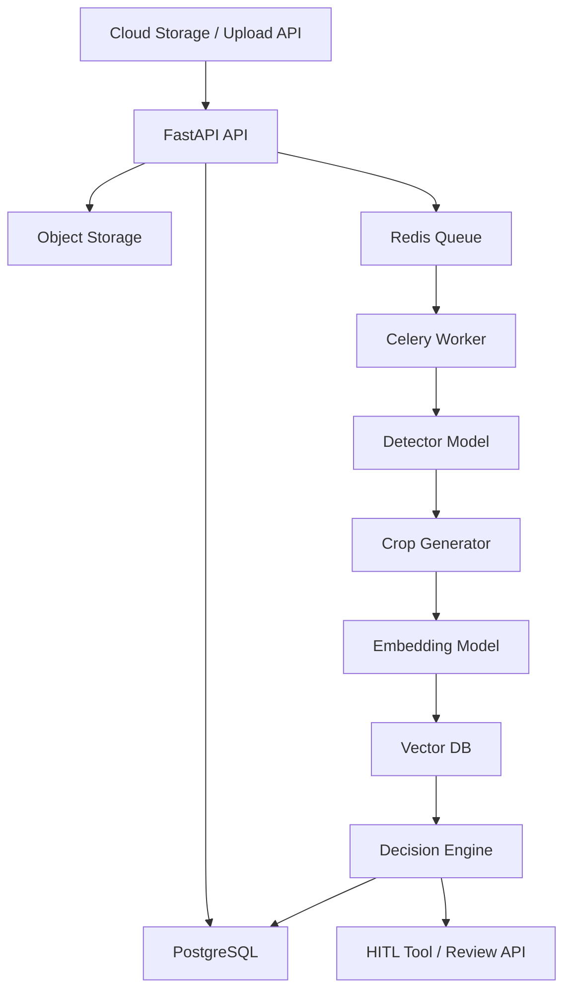

# Production Backend Plan: Few-Shot SKU Detection, Auto-Annotation, and Human-in-the-Loop Learning

## 0. Executive Summary

The goal is to build a **production-grade backend system** that receives supermarket shelf images from the cloud, detects product facings, crops each product, recognizes the exact SKU, auto-generates annotations when confidence is high, routes uncertain cases to human review, and learns from human corrections.

The company problem is not simply object detection. The real production problem is:

> How can we reduce the manual annotation and new-SKU onboarding effort from hundreds/thousands of images per SKU to around 10-50 verified examples per SKU while maintaining reliable SKU-level recognition?

The recommended design is a **two-flow backend system**:

1. **Daily Auto-Annotation Pipeline**  
   Processes normal uploaded shelf images, generates boxes and SKU labels, and sends low-confidence cases to HITL review.

2. **New SKU Onboarding Pipeline**  
   Takes 10-50 verified examples for a new SKU, creates a SKU identity, builds visual embeddings/prototypes, validates recognition quality, and activates the SKU in the daily pipeline.

A third continuous pipeline supports production quality:

3. **Active Learning / Continuous Improvement Pipeline**  
   Uses human corrections and uncertainty sampling to improve model quality over time without blindly trusting unverified predictions.

---

## 1. Current Known Information

### Business Context

- The company has many brands and SKUs.
- Their existing model needs around **500-1000 images** to recognize a new SKU with acceptable accuracy.
- They want to reduce this to around **10-50 images per SKU**.
- They currently use an open-source auto-labeling solution, but it is not enough for scalable SKU onboarding.
- Example business bottleneck: it may take months to enable image recognition for one brand in one market.
- They currently have around **5 manual annotators**.
- Desired direction: reduce manual annotators into **HITL reviewers** who mainly confirm, reject, or correct uncertain annotations.

### Technical Context

- Current focus: **backend only**, no frontend requirement for now.
- Input: shelf images uploaded by supermarket/merchandiser staff through cloud storage or a cloud upload API.
- Main task:
  - Detect every relevant product/facing with bounding boxes.
  - Classify each detected product into exact SKU.
  - Decide whether prediction is known, uncertain, or unknown/new.
- Available pilot data:
  - Around 1000 Lipton brand shelf images.
  - One text annotation file per shelf image.
  - The provided sample annotation is YOLO-style: `class_id x_center y_center width height`.

---

## 2. EDA First: What We Must Do Before Modeling

EDA is not optional. It is the first production step because the company goal depends heavily on data quality, label consistency, class imbalance, and SKU visual similarity.

### 2.1 Immediate EDA on the Provided Sample

Provided sample:

- Image: `Transmed Others 212.jpg`
- Label file: `Transmed Others 212.txt`
- Image size: **1530 x 2040** pixels.
- Annotation format: YOLO normalized coordinates.
- Number of annotated boxes in this sample: **18**.
- Number of unique class IDs in this sample: **9**.
- Class IDs present: `0, 26, 27, 32, 36, 42, 47, 57, 64`.

Class distribution in the sample:

| class_id | count |
|---:|---:|
| 0 | 2 |
| 26 | 3 |
| 27 | 1 |
| 32 | 2 |
| 36 | 3 |
| 42 | 1 |
| 47 | 1 |
| 57 | 3 |
| 64 | 2 |

Box statistics from the sample:

| Metric | Value |
|---|---:|
| Mean bbox width | ~104.61 px |
| Mean bbox height | ~69.84 px |
| Mean bbox area | ~7413 px² |
| Min bbox area | ~4822 px² |
| Max bbox area | ~12484 px² |
| Normalized y-center range | 0.606 to 0.658 |

Important observation:

> The boxes in the sample are concentrated around one horizontal shelf row, even though the image contains many visible products from multiple brands. This suggests the labels may cover only target SKUs, not every visible product in the full image.

This affects the modeling strategy. If the goal is to detect every product facing in the image, the existing annotations may be incomplete for class-agnostic product detection. If the goal is only to detect target SKUs/brands, the data is more directly usable.

### 2.2 Full Dataset EDA Checklist

Run this on the full 1000-image dataset before training anything.

#### A. File Integrity

Check:

- Number of images.
- Number of label files.
- Missing image-label pairs.
- Empty label files.
- Corrupt/unreadable images.
- Duplicate images.
- Duplicate label files.
- File naming consistency.

Expected output:

```text
eda_reports/file_integrity_report.csv
eda_reports/missing_pairs.csv
eda_reports/corrupt_images.csv
```

#### B. Image Statistics

Calculate:

- Width/height distribution.
- Aspect ratio distribution.
- File size distribution.
- Brightness distribution.
- Blur score distribution.
- Overexposure/underexposure rate.
- Repeated scene similarity if possible.

Expected plots:

```text
image_width_height_distribution.png
aspect_ratio_distribution.png
brightness_distribution.png
blur_score_distribution.png
```

#### C. Annotation Statistics

Calculate:

- Number of boxes per image.
- Number of classes per image.
- Class frequency distribution.
- Box width/height distribution.
- Box area distribution.
- Box center heatmap.
- Per-class box size distribution.
- Images with zero boxes.
- Images with unusually many boxes.

Expected plots:

```text
boxes_per_image.png
class_frequency.png
bbox_area_distribution.png
bbox_center_heatmap.png
per_class_bbox_size.png
```

#### D. Label Quality Checks

Detect:

- Boxes outside image boundaries.
- Boxes with zero or negative width/height.
- Tiny boxes below practical threshold.
- Extremely large boxes.
- Duplicate boxes with high IoU.
- Same object annotated multiple times.
- Suspicious class IDs not in class mapping.
- Label files with malformed rows.

Expected output:

```text
eda_reports/invalid_boxes.csv
eda_reports/duplicate_boxes.csv
eda_reports/suspicious_labels.csv
```

#### E. SKU/Class Balance

For each class/SKU:

- Number of instances.
- Number of images containing this SKU.
- Average instances per image.
- Typical bbox size.
- Crop examples.
- Whether the class has enough examples for 10/20/50-shot experiments.

This is critical because the few-shot onboarding claim depends on per-SKU counts, not just total images.

#### F. Crop-Level EDA

Create product crops from ground-truth boxes and analyze:

- Crop resolution distribution.
- Blur/quality per crop.
- Visual similarity between SKUs.
- Hard pairs: SKUs that look almost identical.
- Bad crops due to wrong/incomplete boxes.

Expected output:

```text
crops/class_0/sample_grid.jpg
crops/class_26/sample_grid.jpg
...
eda_reports/crop_quality_report.csv
```

#### G. Manual Visual Audit

Randomly sample 100-200 images and inspect:

- Are all target products annotated?
- Are non-target products intentionally ignored?
- Are boxes tight enough?
- Are labels consistent?
- Are repeated facings labeled separately?
- Are occluded products labeled or ignored?
- Are price tags/signage accidentally labeled?

This step is important because pure automated EDA will not reveal annotation policy mistakes.

---

## 3. Main Product Definition

### 3.1 Daily Usage Flow



### 3.2 New SKU Onboarding Flow



### 3.3 Continuous Learning Flow



---

## 4. Backend Modules

### Module 1: Data Ingestion Service

Purpose:

- Receive images from cloud upload/API.
- Validate image files.
- Create image records.
- Store original images in object storage.
- Start asynchronous processing jobs.

Responsibilities:

- Accept image upload or cloud object reference.
- Store metadata in PostgreSQL.
- Store image in object storage such as S3/GCS/Azure Blob/MinIO.
- Emit job to processing queue.

Suggested tools:

- FastAPI
- Pydantic
- PostgreSQL
- MinIO/S3
- Celery + Redis

Example API:

```http
POST /images/upload
POST /images/from-cloud-uri
GET  /images/{image_id}/status
```

---

### Module 2: Dataset Parser and Annotation Converter

Purpose:

- Parse YOLO annotation files.
- Convert annotations to internal DB format.
- Convert internal annotations back to YOLO/COCO if needed.

Responsibilities:

- Read `class_id x_center y_center width height`.
- Convert normalized YOLO boxes to pixel boxes.
- Validate coordinates.
- Link each image to its annotations.
- Support future conversion to COCO/Label Studio/CVAT.

Suggested tools:

- Python
- Pandas
- Pydantic
- OpenCV/Pillow

Output internal schema:

```json
{
  "image_id": "uuid",
  "bbox_xyxy": [x1, y1, x2, y2],
  "bbox_yolo": [x_center, y_center, width, height],
  "class_id": 32,
  "sku_id": "optional_until_mapping_available",
  "source": "human_ground_truth"
}
```

---

### Module 3: EDA and Data Quality Module

Purpose:

- Understand dataset before modeling.
- Detect label problems.
- Generate reports for the company and team.

Responsibilities:

- File integrity checks.
- Class balance analysis.
- Bounding box statistics.
- Image quality checks.
- Crop quality checks.
- Visual grids per class/SKU.
- Data split planning.

Suggested tools:

- Python
- Pandas
- NumPy
- OpenCV
- Matplotlib
- Jupyter notebooks or scripts

Deliverables:

```text
reports/eda_summary.md
reports/eda_metrics.csv
reports/class_distribution.png
reports/bbox_heatmap.png
reports/sample_crops_by_class/
```

---

### Module 4: Product/Face Detector

Purpose:

- Detect product facings in shelf images.

Recommended implementation strategy:

Start with two baselines:

1. **Direct SKU detector baseline**  
   Train YOLO with each SKU class directly. This gives a quick baseline and uses the existing YOLO labels.

2. **Class-agnostic/product-facing detector**  
   Train or adapt a detector to find product boxes independently from SKU class. This is more scalable for the final architecture.

Why both?

- Direct SKU YOLO gives a measurable baseline quickly.
- Class-agnostic detection supports the final crop-to-match production design.

Suggested tools:

- Ultralytics YOLO
- RT-DETR as optional comparison
- OpenCV for post-processing

Inputs:

```text
shelf image
```

Outputs:

```json
[
  {
    "bbox": [x1, y1, x2, y2],
    "objectness": 0.93
  }
]
```

Important risk:

If current labels only cover Lipton/target SKUs, they may not be enough to train a true every-product detector. In that case, the initial detector will be target-product focused, and later we can improve class-agnostic detection using weak labeling, foundation models, or additional annotation.

---

### Module 5: Crop Generator

Purpose:

- Convert detector boxes into clean crop images for SKU recognition.

Responsibilities:

- Crop detected products.
- Add optional padding around boxes.
- Normalize crop size.
- Store crop image in object storage.
- Store crop metadata in DB.
- Reject poor crops if too small/blurred.

Suggested tools:

- OpenCV
- Pillow
- NumPy

Output:

```json
{
  "crop_id": "uuid",
  "image_id": "uuid",
  "bbox": [x1, y1, x2, y2],
  "crop_uri": "s3://bucket/crops/crop_id.jpg",
  "quality_score": 0.87
}
```

---

### Module 6: SKU Embedding Extractor

Purpose:

- Convert each product crop into a vector embedding that captures its visual identity.

Responsibilities:

- Load crop.
- Preprocess crop.
- Run embedding model.
- Normalize vector.
- Store vector in vector database.

Candidate models:

- CLIP image encoder.
- DINOv2.
- ResNet/EfficientNet trained with metric learning.
- Siamese network.
- Supervised contrastive model.

Recommended path:

1. Start with pretrained CLIP/DINOv2 embeddings as no/low-training baseline.
2. Evaluate retrieval accuracy on SKU crops.
3. Fine-tune using supervised contrastive/triplet loss if needed.

Output:

```json
{
  "crop_id": "uuid",
  "embedding": [0.012, -0.543, ...],
  "embedding_model_version": "dinov2_v1"
}
```

---

### Module 7: Vector Search / SKU Matching

Purpose:

- Match a new product crop to known SKU examples using nearest-neighbor search.

Responsibilities:

- Store embeddings for reference SKU examples.
- Search nearest examples for a new crop.
- Return top-k SKU candidates.
- Apply metadata filtering by brand/market/category if available.

Suggested tools:

- Qdrant, or
- PostgreSQL + pgvector, or
- FAISS for experiments only.

Recommended decision:

- For a clean backend prototype: **PostgreSQL + pgvector** if you want fewer moving parts.
- For a more scalable similarity-service architecture: **Qdrant + PostgreSQL**.

Example vector search result:

```json
{
  "crop_id": "uuid",
  "top_candidates": [
    {"sku_id": "lipton_green_tea_lemon_25", "score": 0.91},
    {"sku_id": "lipton_green_tea_pure_25", "score": 0.68},
    {"sku_id": "lipton_green_tea_mint_25", "score": 0.61}
  ]
}
```

---

### Module 8: Decision Engine

Purpose:

- Decide whether a crop is known, uncertain, or unknown/new.

Inputs:

- Detection confidence.
- SKU similarity score.
- Difference between top-1 and top-2 SKU score.
- Crop quality score.
- SKU-specific threshold.
- Whether SKU is newly onboarded.

Decision rules:

```text
High detection confidence
+ high SKU similarity
+ strong top1-top2 gap
= auto-approved known SKU

Medium confidence
or weak top1-top2 gap
= human review

Very low similarity to all known SKUs
= unknown/new product candidate
```

Example output:

```json
{
  "decision": "needs_human_review",
  "predicted_sku_id": "lipton_green_tea_lemon_25",
  "confidence": 0.61,
  "top_candidates": [
    "lipton_green_tea_lemon_25",
    "lipton_green_tea_pure_25",
    "lipton_green_tea_mint_25"
  ],
  "reason": "top1_top2_gap_too_small"
}
```

Important production note:

Do not use one threshold forever. Thresholds should be calibrated:

- globally,
- per SKU,
- per market,
- per newly onboarded SKU,
- and adjusted based on business tolerance for false positives.

---

### Module 9: Auto-Annotation Writer

Purpose:

- Save generated annotations in a standard format.
- Export annotations when needed.

Responsibilities:

- Save model-generated boxes and labels.
- Mark review status.
- Save model version and confidence scores.
- Export accepted annotations as YOLO/COCO/CVAT/Label Studio format.

Annotation statuses:

```text
auto_approved
needs_review
human_corrected
human_rejected
unknown_candidate
```

---

### Module 10: Human-in-the-Loop Review Backend

Purpose:

- Send only difficult/uncertain cases to human reviewers.
- Capture confirmation/correction.
- Store verified labels.

Frontend may be:

- CVAT,
- Label Studio,
- or a future custom UI.

Since the project scope is backend, implement the review API and optionally integrate with an existing labeling tool.

Example API:

```http
GET  /review/queue
GET  /review/items/{item_id}
POST /review/items/{item_id}/accept
POST /review/items/{item_id}/reject
POST /review/items/{item_id}/correct
```

Review item example:

```json
{
  "review_item_id": "uuid",
  "image_uri": "s3://bucket/images/image.jpg",
  "crop_uri": "s3://bucket/crops/crop.jpg",
  "bbox": [512, 830, 630, 910],
  "predicted_sku_id": "lipton_green_tea_mint_25",
  "top_candidates": [
    "lipton_green_tea_mint_25",
    "lipton_green_tea_pure_25",
    "lipton_green_tea_lemon_25"
  ],
  "confidence": 0.58,
  "reason": "uncertain_sku"
}
```

---

### Module 11: New SKU Onboarding Service

Purpose:

- Add a new SKU with only 10-50 examples.

Responsibilities:

- Create SKU metadata.
- Upload reference images.
- Run quality checks.
- Crop/verify product examples.
- Extract embeddings.
- Build SKU prototype.
- Insert into vector database.
- Validate recognition quality.
- Activate SKU only if it passes quality gate.

Example API:

```http
POST /skus
POST /skus/{sku_id}/reference-images
POST /skus/{sku_id}/build-prototype
POST /skus/{sku_id}/validate
POST /skus/{sku_id}/activate
```

SKU metadata example:

```json
{
  "sku_id": "lipton_green_tea_lemon_25",
  "brand": "Lipton",
  "variant": "Green Tea Lemon",
  "size": "25 bags",
  "market": "UAE",
  "barcode": "optional",
  "status": "pending_validation"
}
```

Key production principle:

> New SKUs should first be added to the SKU registry and vector database. Full detector retraining should be optional and scheduled later, not required immediately for every SKU.

---

### Module 12: Active Learning Service

Purpose:

- Reduce annotation cost by selecting the most valuable cases for human review.

Priority logic:

High priority cases include:

- Low confidence predictions.
- Top-1 and top-2 SKU scores are close.
- Unknown/new product candidates.
- New SKU examples.
- Rare SKUs.
- SKUs with historically poor accuracy.
- Images from new markets/stores.
- Low-quality images where model may fail.

Example priority score:

```text
priority_score =
    uncertainty_score
  + unknown_score
  + rarity_score
  + new_sku_score
  + business_importance_score
```

Output:

```json
{
  "review_item_id": "uuid",
  "priority_score": 0.92,
  "reason": ["low_confidence", "rare_sku", "new_market"]
}
```

---

### Module 13: Training and Evaluation Pipeline

Purpose:

- Train models in a reproducible way.
- Evaluate new versions before deployment.

Pipelines:

1. Detector training pipeline.
2. Embedding model training/fine-tuning pipeline.
3. Threshold calibration pipeline.
4. New SKU few-shot evaluation pipeline.
5. Regression test pipeline before model promotion.

Suggested tools:

- PyTorch
- Ultralytics YOLO
- MLflow
- DVC
- Docker

Important rule:

> Never promote a new model just because it trained successfully. Promote only if it beats the current model on agreed evaluation metrics.

---

### Module 14: Model Registry and Versioning

Purpose:

- Track which model produced which annotation.
- Enable rollback.
- Make experiments reproducible.

Track:

- Detector model version.
- Embedding model version.
- Dataset version.
- Class/SKU registry version.
- Threshold config version.
- Training hyperparameters.
- Evaluation metrics.

Suggested tools:

- MLflow for experiment tracking and model registry.
- DVC for dataset versioning.
- Git for code versioning.

---

### Module 15: Monitoring and Observability

Purpose:

- Know if the production system is improving or failing.

Track operational metrics:

- Number of images uploaded.
- Number of images processed.
- Average processing time.
- Detection time.
- Embedding search time.
- API error rate.
- Worker queue length.

Track AI/business metrics:

- Auto-approval rate.
- Human review rate.
- Human correction rate.
- Unknown product rate.
- Per-SKU accuracy.
- Top-1 and top-3 SKU accuracy.
- Drift by market/store/time.
- New SKU onboarding success rate.

Suggested tools:

- Python logging initially.
- Prometheus + Grafana later.
- Sentry for backend errors.
- Evidently AI or custom drift reports.

---

## 5. Suggested Technology Stack

### Core Language

| Need | Tool |
|---|---|
| Main language | Python |
| ML framework | PyTorch |
| API/backend | FastAPI |
| Data validation | Pydantic |

### Computer Vision / ML

| Need | Tool |
|---|---|
| Object detection baseline | Ultralytics YOLO |
| Image processing | OpenCV, Pillow |
| Augmentation | Albumentations |
| Embeddings | CLIP, DINOv2, or custom Siamese/contrastive model |
| Metrics/experiments | scikit-learn, NumPy, Pandas |

### Backend / Infrastructure

| Need | Tool |
|---|---|
| API | FastAPI |
| Async workers | Celery |
| Queue/cache | Redis |
| Metadata DB | PostgreSQL |
| Object storage | MinIO locally, S3/GCS/Azure later |
| Vector search | Qdrant or PostgreSQL + pgvector |
| Containerization | Docker, Docker Compose |

### HITL / Annotation

| Need | Tool |
|---|---|
| Annotation/review tool | CVAT or Label Studio |
| Backend review API | Custom FastAPI endpoints |

### MLOps

| Need | Tool |
|---|---|
| Experiment tracking | MLflow |
| Model registry | MLflow Model Registry |
| Dataset versioning | DVC |
| Monitoring | Prometheus/Grafana later, logging first |

---

## 6. Database Design Draft

### `images`

```sql
image_id UUID PRIMARY KEY,
original_uri TEXT,
width INT,
height INT,
market TEXT,
store_id TEXT,
uploaded_at TIMESTAMP,
processing_status TEXT,
quality_score FLOAT
```

### `skus`

```sql
sku_id TEXT PRIMARY KEY,
class_id INT,
brand TEXT,
variant TEXT,
size TEXT,
market TEXT,
barcode TEXT,
status TEXT,
created_at TIMESTAMP
```

### `annotations`

```sql
annotation_id UUID PRIMARY KEY,
image_id UUID,
crop_id UUID,
sku_id TEXT,
class_id INT,
x1 FLOAT,
y1 FLOAT,
x2 FLOAT,
y2 FLOAT,
detection_confidence FLOAT,
sku_confidence FLOAT,
decision_status TEXT,
source TEXT,
model_version TEXT,
created_at TIMESTAMP
```

### `crops`

```sql
crop_id UUID PRIMARY KEY,
image_id UUID,
crop_uri TEXT,
x1 FLOAT,
y1 FLOAT,
x2 FLOAT,
y2 FLOAT,
quality_score FLOAT,
created_at TIMESTAMP
```

### `human_reviews`

```sql
review_id UUID PRIMARY KEY,
annotation_id UUID,
reviewer_id TEXT,
action TEXT,
old_sku_id TEXT,
corrected_sku_id TEXT,
comment TEXT,
reviewed_at TIMESTAMP
```

### `model_versions`

```sql
model_version TEXT PRIMARY KEY,
model_type TEXT,
artifact_uri TEXT,
dataset_version TEXT,
metrics_json JSONB,
created_at TIMESTAMP,
status TEXT
```

### `sku_reference_examples`

```sql
reference_id UUID PRIMARY KEY,
sku_id TEXT,
crop_uri TEXT,
embedding_id TEXT,
quality_score FLOAT,
verified BOOLEAN,
created_at TIMESTAMP
```

---

## 7. API Design Draft

### Image Processing

```http
POST /images/upload
GET  /images/{image_id}/status
POST /images/{image_id}/process
GET  /images/{image_id}/annotations
```

### Review Queue

```http
GET  /review/queue
GET  /review/items/{item_id}
POST /review/items/{item_id}/accept
POST /review/items/{item_id}/reject
POST /review/items/{item_id}/correct
```

### SKU Management

```http
POST /skus
GET  /skus
GET  /skus/{sku_id}
POST /skus/{sku_id}/reference-images
POST /skus/{sku_id}/build-prototype
POST /skus/{sku_id}/validate
POST /skus/{sku_id}/activate
```

### Model Management

```http
GET  /models
GET  /models/{model_version}/metrics
POST /models/{model_version}/promote
POST /models/{model_version}/rollback
```

### EDA / Reports

```http
POST /eda/run
GET  /eda/reports/{report_id}
```

---

## 8. Experiments Plan

### Experiment 1: Dataset Audit and EDA

Goal:

- Understand the dataset and label quality.

Deliverables:

- EDA report.
- Class distribution.
- Box distribution.
- Visual crop grids.
- Data quality issue list.

Success:

- We know exactly how many SKUs/classes exist.
- We know whether the annotations are complete or target-only.
- We know which classes are underrepresented.

---

### Experiment 2: Direct YOLO SKU Detector Baseline

Goal:

- Establish a simple baseline using current YOLO annotations.

Method:

- Train YOLO where each class ID is a SKU class.
- Evaluate mAP, precision, recall, per-class AP.

Why:

- It gives a fast baseline.
- It shows how hard the dataset is.
- It gives a comparison point for the final pipeline.

Limit:

- Not scalable for new SKUs because new classes usually require retraining.

---

### Experiment 3: Detection + Crop + SKU Classifier Baseline

Goal:

- Separate localization from recognition.

Method:

- Use detector to find boxes.
- Crop ground-truth or predicted products.
- Train crop classifier.

Metrics:

- Detection recall.
- Crop classification accuracy.
- End-to-end SKU accuracy.

---

### Experiment 4: Embedding-Based SKU Matching

Goal:

- Test whether crop embeddings can identify SKUs from few examples.

Method:

- Extract crop embeddings using CLIP/DINOv2/custom model.
- Store reference embeddings per SKU.
- Classify test crops by nearest prototype or nearest neighbor.

Metrics:

- Top-1 accuracy.
- Top-3 accuracy.
- Per-SKU recall.
- Confusion matrix.

---

### Experiment 5: Few-Shot New SKU Simulation

Goal:

- Simulate the company requirement: 10-50 images per new SKU.

Method:

- Hold out some SKU classes as “new SKUs”.
- Give the system only 10, 20, and 50 support examples per held-out SKU.
- Test on unseen shelf crops/images.

Scenarios:

```text
10-shot per SKU
20-shot per SKU
50-shot per SKU
```

Metrics:

- Top-1 SKU accuracy.
- Top-3 SKU accuracy.
- Unknown/new SKU detection.
- Human review rate needed to maintain target quality.

---

### Experiment 6: Unknown Product Detection

Goal:

- Detect products that are not in the known SKU database.

Method:

- Remove some SKUs from the known database.
- Test whether the system marks them as unknown instead of forcing wrong labels.

Metrics:

- Unknown detection precision.
- Unknown detection recall.
- False known rate.
- False unknown rate.

This is very important for production because a confident wrong SKU label is worse than sending the case to a human.

---

### Experiment 7: Decision Threshold Calibration

Goal:

- Choose thresholds for auto-approval vs HITL.

Method:

- Try different thresholds for similarity score and top1-top2 gap.
- Measure trade-off between auto-approval rate and correction rate.

Output:

```text
Threshold config v1:
- auto approve if similarity > 0.85 and top1-top2 gap > 0.15
- review if similarity 0.55-0.85 or gap <= 0.15
- unknown if similarity < 0.55
```

These numbers are placeholders; they must be calibrated empirically.

---

### Experiment 8: Active Learning Simulation

Goal:

- Prove that reviewing uncertain samples improves faster than random annotation.

Method:

- Compare two annotation strategies:
  1. Random samples.
  2. Uncertainty-selected samples.
- Add reviewed samples gradually.
- Measure improvement curve.

Metrics:

- Accuracy vs number of reviewed samples.
- Reduction in manual labels needed.
- Review queue quality.

---

## 9. Evaluation Metrics

### Detection Metrics

- mAP@0.5
- mAP@0.5:0.95
- Precision
- Recall
- Missed product/facing rate
- False positive rate

### SKU Recognition Metrics

- Top-1 accuracy
- Top-3 accuracy
- Per-SKU precision/recall
- Confusion matrix
- Similar-SKU confusion rate

### End-to-End Metrics

- Correct box + correct SKU rate
- Auto-approved annotation accuracy
- Human review rate
- Unknown product detection accuracy

### Business Metrics

- Manual annotation reduction
- Average human actions per image
- Time saved per image
- Images needed per SKU
- New SKU onboarding time
- Percentage of annotations auto-approved safely

Example reporting format:

| Setup | Examples/SKU | Top-1 SKU Acc | Top-3 SKU Acc | Auto-Approve Rate | Human Review Rate | Correction Rate |
|---|---:|---:|---:|---:|---:|---:|
| Baseline YOLO SKU Detector | 500+ | TBD | TBD | TBD | TBD | TBD |
| Embedding Matcher | 10 | TBD | TBD | TBD | TBD | TBD |
| Embedding Matcher | 20 | TBD | TBD | TBD | TBD | TBD |
| Embedding Matcher | 50 | TBD | TBD | TBD | TBD | TBD |

---

## 10. Deployment Architecture

### Local Development with Docker Compose

Services:

```text
api                 FastAPI backend
worker              Celery worker for image processing
postgres            Metadata and annotations
redis               Queue/cache
minio               Object storage
qdrant              Vector database, if chosen
mlflow              Experiment tracking/model registry
```

### Production-Like Flow



---

## 11. Repository Structure

Recommended project structure:

```text
retail-sku-backend/
  README.md
  docker-compose.yml
  .env.example

  app/
    main.py
    api/
      routes_images.py
      routes_annotations.py
      routes_review.py
      routes_skus.py
      routes_models.py
    core/
      config.py
      logging.py
    db/
      models.py
      session.py
      migrations/
    schemas/
      image.py
      annotation.py
      sku.py
      review.py
    services/
      ingestion_service.py
      storage_service.py
      annotation_service.py
      review_service.py
      sku_service.py
      decision_engine.py
    workers/
      celery_app.py
      tasks.py

  ml/
    detection/
      train_yolo.py
      infer_detector.py
    recognition/
      extract_embeddings.py
      train_metric_model.py
      match_sku.py
    active_learning/
      sampling.py
    evaluation/
      metrics.py
      evaluate_end_to_end.py
    preprocessing/
      crop_generator.py
      quality_checks.py

  eda/
    run_eda.py
    annotation_audit.py
    image_quality_report.py
    crop_grid_generator.py

  configs/
    detector.yaml
    recognizer.yaml
    thresholds.yaml
    data.yaml

  notebooks/
    01_initial_eda.ipynb
    02_yolo_baseline.ipynb
    03_embedding_matching.ipynb
    04_few_shot_simulation.ipynb

  reports/
    eda/
    experiments/

  tests/
    test_yolo_parser.py
    test_bbox_conversion.py
    test_decision_engine.py
    test_api_images.py
```

---

## 12. Milestone Plan

### Milestone 0: Requirements and Data Access

Deliverables:

- Confirm annotation policy.
- Confirm class mapping file.
- Confirm whether labels cover all products or only target SKUs.
- Confirm markets and SKU list.
- Confirm success metrics with company.

Questions to answer:

- What does each class ID mean?
- Are all products annotated or only company SKUs?
- Are packshot/catalog images available?
- What accuracy is considered acceptable?
- What is the maximum acceptable human review rate?

---

### Milestone 1: EDA and Data Audit

Deliverables:

- Full EDA report.
- Class imbalance report.
- Annotation quality report.
- Crop samples per class.
- Dataset split strategy.

Exit criteria:

- Dataset quality is understood.
- Bad labels are identified.
- First train/val/test split is defined.

---

### Milestone 2: Direct YOLO Baseline

Deliverables:

- YOLO training pipeline.
- Baseline metrics.
- Per-class AP.
- Error analysis.

Exit criteria:

- We know how well a simple direct detector performs.

---

### Milestone 3: Crop Recognition Baseline

Deliverables:

- Crop extraction pipeline.
- Crop classifier or embedding baseline.
- SKU confusion matrix.

Exit criteria:

- We know if SKU recognition from crops is feasible.

---

### Milestone 4: Embedding Matcher + Vector Search

Deliverables:

- Embedding extraction service.
- Vector DB integration.
- Top-k SKU matching.
- Prototype creation per SKU.

Exit criteria:

- Given a crop, system returns top-k SKU candidates with similarity scores.

---

### Milestone 5: Decision Engine + HITL Queue

Deliverables:

- Known/uncertain/unknown decision rules.
- Review queue API.
- Human correction storage.
- Basic active learning priority score.

Exit criteria:

- High-confidence predictions are auto-approved.
- Uncertain cases are sent to review.
- Human corrections are saved as verified labels.

---

### Milestone 6: New SKU Onboarding

Deliverables:

- SKU creation API.
- Reference image upload.
- Prototype building.
- 10/20/50-shot evaluation.
- SKU activation workflow.

Exit criteria:

- A new SKU can be added to the system without full detector retraining.

---

### Milestone 7: End-to-End Backend MVP

Deliverables:

- Dockerized backend.
- API + worker + DB + storage + vector search.
- End-to-end image processing.
- Annotation export.
- MLflow experiment tracking.

Exit criteria:

- Upload image → process → boxes/crops/SKU predictions → auto-label/review queue.

---

### Milestone 8: Production Hardening

Deliverables:

- Logging.
- Monitoring metrics.
- Model versioning.
- Dataset versioning.
- Error handling.
- Rollback plan.
- Security basics.

Exit criteria:

- System is presentable as production-oriented, not only a notebook demo.

---

## 13. Risks and Mitigations

| Risk | Why It Matters | Mitigation |
|---|---|---|
| Labels only cover target products | Cannot train true every-product detector | Start with target detector; use class-agnostic strategy later |
| No class mapping file | Cannot interpret SKU names | Request mapping urgently |
| Similar SKUs look almost identical | High confusion | Use top-3 HITL, metric learning, OCR/packaging metadata later |
| New SKU examples are low quality | Few-shot onboarding fails | Add quality gate before onboarding |
| Model overconfident on wrong SKU | Bad auto-labels enter system | Conservative thresholds + calibration + human review |
| Human corrections are noisy | Active learning may harm model | Store reviewer ID, audit corrections, use verified labels only |
| Class imbalance | Rare SKUs fail | Per-SKU metrics, targeted active learning |
| Market/domain shift | UAE model may fail in other markets | Track market metadata, evaluate per market |
| Full retraining needed too often | Not scalable | Use embedding database for fast SKU addition |

---

## 14. What We Need From the Company Next

Critical:

1. Class ID to SKU name mapping.
2. Confirmation whether annotations cover all products or only company/target SKUs.
3. List of all SKUs in the pilot dataset.
4. Number of images/instances per SKU.
5. Packshot or catalog images per SKU, if available.
6. Current definition of acceptable accuracy.
7. Current manual annotation time per image.
8. Current auto-labeling tool and its failure cases.
9. Whether images are from one market or multiple markets.
10. Desired annotation export format.

Very useful:

1. Brand/category hierarchy.
2. Barcode/product metadata.
3. Store/market metadata.
4. Existing model outputs, if they can share them.
5. Current human annotation guidelines.
6. Examples of correct vs incorrect annotations.

---

## 15. Final Recommended MVP Scope

The first strong MVP should include:

1. Full EDA report on the 1000-image dataset.
2. YOLO baseline using existing annotations.
3. Crop extraction pipeline.
4. Embedding-based SKU matching.
5. Vector database integration.
6. Decision engine for known/uncertain/unknown.
7. HITL review queue API.
8. New SKU onboarding API using 10-50 examples.
9. MLflow experiment tracking.
10. Docker Compose deployment.

This is enough to prove the production concept without overbuilding a full enterprise platform.

---

## 16. Final One-Sentence Project Definition

> A production-oriented backend system for retail shelf image auto-annotation that combines product detection, crop-based SKU recognition, few-shot SKU onboarding, vector similarity search, human-in-the-loop review, and active learning to reduce manual annotation effort and accelerate expansion to new SKUs and markets.